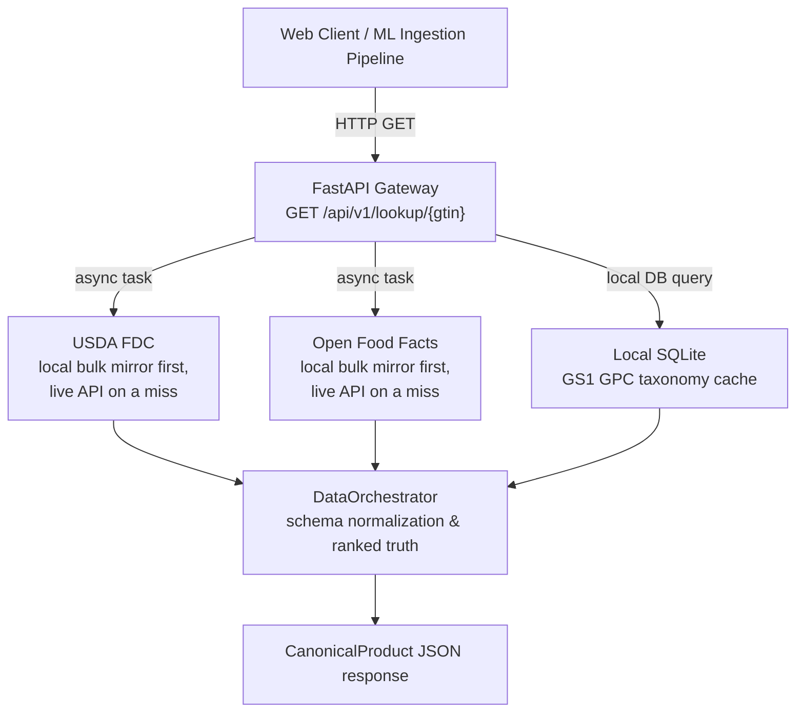
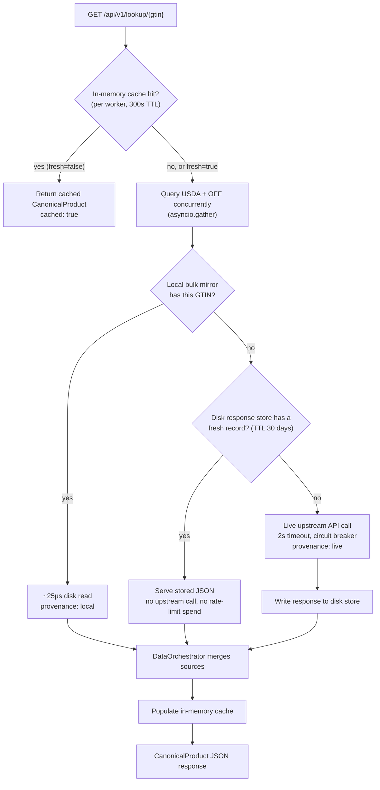
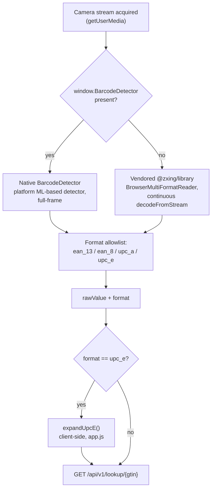
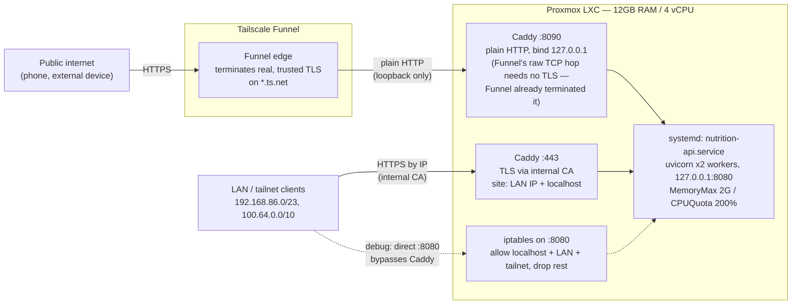

# ARCH.md - System Architecture

## Architectural Overview
The Unified Food Intelligence API is an asynchronous, container-native data aggregation gateway. It acts as a performance-optimized orchestration layer between web clients (or ingestion pipelines) and three distinct food telemetry datasets.

## Key Technical Design Components

### 1. Non-Blocking I/O Gateway
The runtime leverages an ASGI architecture powered by **FastAPI** and **Uvicorn**. Instead of blocking execution lines on latent upstream network calls, `asyncio.gather` spawns concurrent I/O operations. The worst-case latency of a single request is capped by the slowest responding service, rather than the cumulative sum of all services. Synchronous upstream SDKs (usda-fdc, openfoodfacts) are bridged into the event loop via thread-pool executors.

### 2. Tiered Storage & Caching Layer
To keep the service deployable on small hosts (a DigitalOcean App Platform container, a Proxmox LXC) without heavy infrastructure like Redis, caching and local data are layered in four tiers, consulted in this order for a single-source fetch:

1. **In-Memory LRU/TTL Cache:** `cachetools.TTLCache` caches hot GTIN lookups at the application level (default: 1024 entries, 300s TTL — tunable via `LOOKUP_CACHE_MAX_SIZE` / `LOOKUP_CACHE_TTL_S`) to prevent redundant network round-trips for high-volume items. Only results with at least one contributing source are cached, so transient upstream failures can recover. Entries are keyed on the **GTIN-14 normalized** barcode, so the same product written with different zero-padding shares one entry rather than costing a fresh round trip each way.

   A cached response is marked `cached: true`. Its `upstream_latency_ms` describes the fetch that *produced* the data, not the request that just returned it — without the flag, a 1 ms cache hit would still claim it spent 500 ms querying USDA.

   The cache is **per worker process**. Running `--workers N` gives N independent caches, so each worker warms separately and a repeated GTIN can miss until every worker has seen it. That is the accepted cost of avoiding a shared cache tier (see the Redis note above); with the default two workers it means at most one extra upstream fetch per hot barcode.
2. **Bundled SQLite Database:** Serves as a static read-only cache baked into the Docker image at build time, storing the GS1 Global Product Classification taxonomy (food segments) to enable immediate local lookups without network overhead. At runtime the app can self-update the taxonomy from GS1 when a newer release is published.

The taxonomy import is **atomic and cross-process locked**. Every uvicorn worker runs the startup lifespan, so `--workers N` means N processes reach the importer on the same boot. It builds into a temporary file and `os.replace()`s it into position, and holds an exclusive `flock` for the whole decide-and-import sequence — so a second worker waits, then finds the work already done rather than re-downloading 27 MB and rebuilding the same file underneath the first.

3. **Local Bulk Mirrors (`app/core/fdc_local.py`, `app/core/off_local.py`):** both remote sources publish their entire corpus as a bulk download — USDA twice a year, Open Food Facts daily — and the API imports each into a local SQLite database (`data/fdc.sqlite3`, ~327 MB / 442k barcodes; `data/off.sqlite3`, ~1.2 GB / 2.24M products). The orchestrator consults the mirror **before** the live API: a hit answers in ~25 µs with no API key, no rate-limit spend, and no network dependency; a miss (a product newer than the export) falls through to the live API, which stays authoritative for anything the mirror hasn't got. `provenance` in the lookup response records, per source, whether the answer came from the mirror (with its dataset date) or the live API. Neither database is committed — each is published as a GitHub release asset (`fdc-YYYY-MM-DD` / `off-YYYY-MM-DD` tags, `.xz`-compressed) and expanded on first startup. Build/refresh mechanics, dataset-revision handling, and size/latency tables are in README.md's "Local USDA FDC copy" / "Local Open Food Facts copy" sections.

4. **On-Disk Response Store:** every upstream response is kept as an individual JSON record under `data/responses/`, with the payload as it arrived and a UTC timestamp, and served on a repeat lookup within its TTL (default 30 days — food composition is close to static).

   This is load-bearing rather than decorative. The in-memory cache dies with the process, so every deploy re-spent Open Food Facts' entire 15-requests-per-minute allowance re-fetching barcodes already seen; and it is per-worker, so two workers paid twice. A record on disk costs neither a request nor a rate-limit token. It also removes the *search* call from a USDA barcode lookup on the second visit, by remembering which FDC id a barcode resolved to.

   Writes are atomic (temp file + `os.replace`), so nothing ever reads a half-written record, and `scripts/import_store_to_sqlite.py` turns the corpus into a queryable database — the payload preserved verbatim, with the fields worth querying lifted out beside it.

### 3. Thread Isolation Between Upstreams

Both vendor SDKs (`usda-fdc`, `openfoodfacts`) are synchronous, so every call occupies a thread for its entire duration. Each source therefore gets its **own bounded thread pool** (`UPSTREAM_MAX_THREADS`, default 8) rather than sharing asyncio's default executor.

This is not a micro-optimization. On the shared pool a stalled upstream holds every thread, and a perfectly healthy *other* upstream then times out waiting for one — a single sick vendor takes the whole service down. The circuit breakers cannot prevent it, because the contention is underneath them; and `asyncio.wait_for` cancels only the await, never the blocking call itself, so a stalled thread stays occupied until the SDK's own socket gives up. Dedicated pools contain the damage to the source that caused it. Threads are named `upstream-off` / `upstream-usda` so a thread dump during an incident says which vendor is stuck.

### 4. Fault Tolerance & Resiliency
External boundaries are protected by tight timeout windows (2.0s per upstream call, via `asyncio.wait_for`) and per-source **circuit breakers** (`app/core/resilience.py`): after 5 consecutive failures a source is skipped entirely for a 60s cooldown, then probed half-open. When an upstream dependency fails or drops connections, the error is isolated. The `DataOrchestrator` converts the partial response into the standardized contract, noting the contributing sources inside the metadata payload (`data_sources`, `upstream_latency_ms`) while ensuring high platform availability (200 OK statuses with partial contents over systematic downtime).

### 5. GPC Category Matching

Mapping a product to the GS1 GPC taxonomy turned out to be a much harder problem than it looked, and the investigation that led to the current design is worth recording so nobody re-discovers the same failure modes by hand.

**The starting point was worse than it appeared.** The only matcher in the system (`orchestrator._fetch_gpc_categories`) took Open Food Facts' first three category tags and did `bricks.description LIKE '%label%'`, first hit wins. On the real local corpus this matched only **44.9%** of OFF products carrying a category — and a manual audit of the matches showed **69% of them were noise**: a generic single word (`beverages`, `snacks`, `food`) happened to be a literal substring of an unrelated brick's name. The clearest case: the tag `en:beverages` matched the brick *"Alcoholic Beverages Variety Packs"* — because "beverages" is a substring of it — and that single collision misclassified 110,000+ products, including things like plain pasta. Three separable causes, each independently confirmed:

1. **Wrong tag order.** OFF orders category tags broad → narrow (`beverages` → `carbonated-drinks` → `sodas`). The code took the *first* three tags — the broadest, least specific ones — which is exactly backwards.
2. **Substring matching, no word boundaries.** `LIKE '%beverages%'` matches the word anywhere, including inside an unrelated brick name.
3. **Even word-boundary matching has a precision ceiling.** A corrected prototype (in-memory word index, most-specific-tag-first, stopword filtering, "prefer the least common word") pushed recall to ~87% — but a manual spot-check still found real misclassifications from polysemous words (`beans` → coffee beans vs. legumes; `spring` → spring water vs. spring onions) and OFF vocabulary that simply isn't in GPC's ~730-word brick description vocabulary at all (`flageolet`, a bean variety, has no representation anywhere in GPC). **No amount of tuning text matching removes this ceiling** — GPC's ~879 bricks are a coarse, closed vocabulary; OFF's millions of free-text, multi-language tags are not.

**FDC's own category was a separate, larger gap.** `usda_data["category"]` (FDC's `branded_food_category`, 100% populated on every branded food) was **never even consulted** — the matcher only ever looked at OFF's tags, so every FDC-only product got an empty `category_hierarchy` regardless of how good a match its own category would have made.

**The fix treats the two sources differently, because they have different shapes.** FDC's `branded_food_category` is a **closed, controlled vocabulary** — 350 distinct values across the whole corpus, GDSN-standardised, Pareto-distributed (the top 20 alone cover 48.7% of all branded foods; the top 90 cover 90.7%). That is small and stable enough to **hand-verify**, so `app/core/gpc_match.py` carries two curated tables — each entry looked up and read against the real GPC taxonomy, not matched by string similarity — covering **91.4%** of all FDC foods with a category:

- `FDC_CATEGORY_TO_BRICK` (154 entries) — the specific GPC brick for a category, used when one exists that faithfully represents it. Beyond the categories researched one at a time, two systematic vocabulary-alignment patterns account for much of this table: FDC borrows GPC **brick** descriptions verbatim for one tier of categories, the same way it borrows **class** descriptions for the table below.
- `FDC_CATEGORY_TO_CLASS` (89 entries) — a coarser GPC class, used when FDC's category is confidently a whole class of products but no single brick fits. The bulk of this table (69 entries) exists because FDC's newer category taxonomy borrows GPC's own **class names verbatim** (modulo whitespace/punctuation noise like `"Fish  Prepared/Processed"` vs. `"Fish - Prepared/Processed"`, both of which occur in the real data and are mapped) — evidence of deliberate vocabulary alignment between the two standards, not a coincidence worth fuzzy-matching around. Thirteen more entries supersede an earlier "no fit" call: the first passes only checked for a *brick* match on categories like `Soda`, `Rice`, and several ethnic/pasta sauce categories, correctly found none, but a class-level fit existed all along and was missed until it was checked directly — verified before being added by measuring exact contamination rates against real product descriptions (e.g. the "Other Cooking Sauces" catch-all is 49.5% literally vinegar by description; the sauce categories added instead came back under 6%), not by name resemblance alone.

`curated_hierarchy_for_fdc_category()` tries the brick table first — the more specific unit — and only falls back to the class table when no brick entry exists for that category; the two tables never both claim the same category key. Categories with no clean GPC equivalent at either level (`Nut & Seed Butters`; `Frozen Patties and Burgers` — spans species-specific meat bricks *and* plant-based patties; `Chili & Stew`; several "Other X" catch-alls — see the "Deliberately excluded" comment block in `gpc_match.py` for the full, current list) are **deliberately left out** rather than forced onto an approximate match: a wrong curated entry undermines the one property that makes curation worth having. 91.4% is close to the honest ceiling for this approach — the remaining uncovered categories are either genuine GPC taxonomy gaps (no pancake/waffle brick or class exists anywhere in GPC, for instance) or long-tail categories too small or internally inconsistent to curate without guessing.

Open Food Facts' tags have no equivalent closed vocabulary to curate — the sensible response there is a smarter *matcher*, not a lookup table pretending to be one. The fuzzy path is retained as the fallback for products without a curated FDC match; its noise rate is why it is explicitly graded lower than the curated path (see below), not why it exists.

**The corrected prototype from the paragraph above was promoted into the codebase on 2026-07-18** (`gpc_match.fuzzy_hierarchy_for_off_categories`), replacing the substring-`LIKE`, first-three-broadest-tags matcher that produced the 69%-noise figure. Two things changed the promotion from theoretical to practical: an FTS5 index over brick descriptions (`bricks_fts`, built by `scripts/import_gpc_xml.py` alongside the taxonomy — the same technique `app/core/search.py` already uses for product-name search, see "Local Name Search" below) gives word-boundary matching and `bm25` ranking for free, so "prefer the least common word" no longer needs its own hand-rolled frequency table — `ORDER BY rank` does that job. A small stopword list (`beverages`, `food`, `products`, and a handful of grammatical connectors like `and`/`based`/`with` that showed up in real OFF tag data) keeps a single overly-generic word from being trusted alone, and tags are now tried narrowest-first (`reversed`), fixing the wrong-order bug directly.

Measured against the real corpus, not just the fixture tests: on a random 2,000-product sample of `data/off.sqlite3`, the old matcher matched 53.1% of products with a category — of which **18.6% were literally the exact documented bug** (`Alcoholic Beverages Variety Packs`, the "beverages" substring collision), meaning roughly 1 in 10 products overall got that one specific wrong answer. The new matcher matched 93.0% of the same sample, and a direct check of five real products carrying `en:beverages` alongside a pasta tag — reproducing the documented failure case exactly — confirms none of them produce `Alcoholic Beverages Variety Packs` any more (two now correctly return no match rather than a wrong one; one produced a materially better match, `Pasta/Noodles Variety Packs`). **Recall went up and the one proven, named bug is gone.** What this measurement does *not* establish is a new overall precision/noise number to replace the 69% figure — that required the original investigation's manual, case-by-case audit, which was not repeated here. The polysemy ceiling documented above (`beans`, `spring`) is unchanged by this promotion; it was never a matching-mechanism problem to begin with. Falls back to the old `LIKE` matcher (with the same stopword filtering and tag-ordering fixes, just without word-boundary matching or ranking) for a `gpc.sqlite3` built before `bricks_fts` existed.

**The result is exposed as a confidence field, not a single ambiguous list.** `CanonicalProduct.category_hierarchy_source` tells a caller which of three paths (or neither) produced the answer:

| value | meaning |
| :--- | :--- |
| `fdc_curated` | FDC's category, resolved through the hand-verified table. High confidence. |
| `reviewed` | An OFF category tag, resolved through its own hand-verified table (`OFF_TAG_TO_BRICK`/`OFF_TAG_TO_CLASS`, added 2026-07-18 — see "Curated OFF tags" below). Same confidence as `fdc_curated`, just keyed on an OFF tag instead of an FDC category. |
| `off_fuzzy` | OFF's tags, resolved by best-effort text matching. Real matches, not verified case by case — a hint, not ground truth. |
| `none` | No path produced a GPC classification. `category_hierarchy` may still carry OFF's *raw* tags as a last-resort fallback in this case — those are upstream labels, not a GPC match, which is exactly why the source stays `none` rather than being labelled as a result. |

Each tier is tried in order and, on a hit, every remaining tier is skipped entirely — not run in the background and discarded, actually skipped, so a curated or reviewed answer never pays for a query it doesn't need.

**Progress on both curation efforts is browsable, not just documented here.** The GPC Mappings tab of `/data` (backed by `GET /api/v1/gpc/mappings`; `/gpc/mappings` redirects there, see PLAN.md item 11) lists every entry in the FDC and OFF-tag curated tables with its resolved GPC hierarchy, a live coverage percentage measured against the local FDC/OFF bulk copies, and the ranked list of categories/tags still uncovered — so the next thing worth curating is visible without reading `gpc_match.py`'s source, and the coverage numbers on screen and in this document are computed the same way.

### Curated OFF tags: the `reviewed` tier

OFF's tags have no closed vocabulary the way FDC's `branded_food_category` does — millions of free-text, self-reported strings, which is why the sensible response for most of them is the fuzzy matcher above, not a lookup table. But the *frequency-ranked head* of real OFF tags is worth hand-verifying too, the same reasoning that justified FDC's curated table in the first place — `OFF_TAG_TO_BRICK`/`OFF_TAG_TO_CLASS` in `gpc_match.py` are that table, built and verified the same way (real codes, looked up and read against `data/gpc.sqlite3`, not guessed).

One real difference changes the shape of the head, though. FDC tags a product with exactly one category; OFF tags a product with its *entire* category chain, broad and narrow simultaneously, so frequency-sorted OFF tags skew heavily toward broad umbrella terms — measured on the real corpus (1,095,172 products with a category, 64,170 distinct tags), the top 10 tags alone are 25.7% of all tag-occurrences, and are almost entirely terms like `en:plant-based-foods-and-beverages`, `en:snacks`, `en:dairies` — exactly the shape of thing the fuzzy matcher's own stopword list already exists to distrust, not brick-specific enough to curate confidently. Curation therefore does not simply work down the frequency list the way FDC's did: each of the initial 31 entries (26 brick, 5 class) was individually checked against real product samples, with a broad tag that has no confident single-brick *or* class fit left out entirely (`en:wines`, `en:peanut-butters`/`en:nut-butters` — the latter mirrors FDC's own pre-existing "Nut & Seed Butters" exclusion) — the same honest-miss philosophy as the FDC tables, not a gap to force-fill. Where an OFF tag maps to the same real-world category as an already-verified FDC one, the entry reuses that exact GPC code rather than re-deriving it (`en:cheeses` → the same brick as FDC's `Cheese`) — it is the same taxonomy fact either source asks about.

The first pass reached a modest 4.4% of real tag-occurrences. **Round 2** (same day) added 69 more brick entries and no new class entries — reusing an already-verified code where an OFF tag maps to the same real-world thing as an existing entry (a dozen cheese-style tags all resolve to the one Cheese brick, since GPC doesn't split cheese by origin or rind the way OFF's tags do), and looking up fresh codes, each checked against real product samples, for categories with no existing FDC-curated equivalent (oils, fruit juice, ice cream, cooking sauces, soups, hummus/dips, sugar, syrups, cereal/protein bars). One real correction came out of that sample-checking discipline: `en:beef` and `en:beef-and-its-products` looked at first glance like they'd fit the same "Beef - Prepared/Processed" brick FDC's own categories use, but their actual samples were raw cuts (`British Beef Braising Steak`, `Sirloin Steaks`) — moved to `Beef - Unprepared/Unprocessed` instead, keeping only `en:beef-dishes` (genuinely prepared meals in its samples) on the FDC-matching brick. 100 brick + 5 class entries now reach **13.5%** of tag-occurrences (898,275 of 6,657,990) — sized to what two careful verification rounds actually produced, not a target chosen in advance, the same incremental spirit as FDC's own multi-round path to 91.4%. Broader coverage is future work, the same round-over-round pattern.

### 6. Nutrient Normalization

`app/core/nutrients.py` is the single table of truth for which nutrients the API publishes and how each is extracted from both upstreams: **36 fields** — the full US Nutrition Facts label panel plus every vitamin and mineral FDC tracks (A, C, D, E, K, the B vitamins, choline, and the trace minerals through molybdenum), plus caffeine. Each `NutrientSpec` carries the FDC nutrient **ids** it accepts (never names — FDC publishes "Energy" twice, in kcal and kJ, and a name key silently keeps whichever came last), the published unit, per-upstream unit conversions (OFF reports everything in grams; FDC mixes mg/µg/IU), and a physical-maximum sanity bound that rejects impossible values (e.g. more than 100 g of protein per 100 g of product) rather than passing garbage through. All values are normalized to a per-100g/100mL baseline. Every field lands on `CanonicalProduct` as a typed `NutrientValue | None`, so "not reported" is distinguishable from zero.

### 7. Local Name Search

`GET /api/v1/search` (backing the `/search` UI) answers "find a product by name" from the local bulk mirrors only — an FTS5 index (`foods_fts` / `products_fts`, built alongside each mirror) over the FDC and OFF product-name columns, merged and deduped by GTIN, falling back to a `LIKE` scan for a mirror built before the FTS table existed. It deliberately returns **identity fields only** (barcode, name, brand, image): the full merged panel for a chosen result comes from the existing `/api/v1/lookup/{gtin}`, so there is exactly one place that merges sources, not a second lighter copy of the logic. It never falls through to the upstreams' live search — OFF's search budget is 10/minute per IP, too tight to spend on keystroke-shaped traffic, and the mirrors already cover the browsable corpus. The route is deliberately `def`, not `async def`: both the FTS and LIKE queries are blocking local disk I/O, and FastAPI/Starlette threads a sync route automatically rather than stalling the event loop (see PLAN.md item 2 — a cold `LIKE` scan once measured ~17s).

### 8. Mobile Scanner (PWA): Cross-Browser Barcode Decode

`/app` (`deploy/site/app/`, see MOBILE_APP.md for the readiness review this
grew out of) is a static PWA — camera barcode scan + name search — with no
backend route of its own; it calls the same `GET /api/v1/lookup/{gtin}` and
`GET /api/v1/search` any other client does. The part worth documenting here
is client-side: which decoder actually runs depends on the browser, because
no browser engine has full first-party barcode detection yet, and the two
paths behave differently in practice, not just in theory.

| Browser / platform | `BarcodeDetector`? | Path taken | Status |
| :--- | :--- | :--- | :--- |
| Chrome/Edge/Samsung Internet, Android | Yes | Native | Verified on a Samsung S23+ — decodes reliably at a distance, the barcode just needs to be somewhere in frame. |
| Chrome/Edge, desktop | Yes | Native | Same code path as Android; not separately device-tested. |
| Firefox, Android or desktop | No | ZXing fallback | Verified on Android — decodes correctly, but see the gap noted below. |
| Safari, iOS | No, as of this writing | ZXing fallback | Not device-tested (no iPhone available). Same fallback code path Firefox already exercised, so that result is meaningful evidence, but iOS-specific behavior (camera permission handling in an installed home-screen PWA — see MOBILE_APP.md) remains unverified. |

**A real, measured gap between the two paths, not just a spec difference.**
Native `BarcodeDetector` picked up a barcode comfortably at a distance in
testing; the ZXing fallback needed the barcode to fill much more of the
frame to decode at all. The likely cause: platform `BarcodeDetector`
implementations run a proper ML-based detector across the full frame,
while ZXing-js's default continuous-decode mode (`decodeFromStream`) scans
the frame as-given, with no region-of-interest cropping or multi-scale
attempt — a barcode occupying a small fraction of the frame is a much
smaller target for it. Not a bug in either path; a real UX and detection-
distance difference a caller on the fallback path should expect. A
viewfinder overlay that also crops the decode region would plausibly close
this gap directly, not just make the target clearer — tracked as PLAN.md
item 13, not yet built.

**UPC-E is handled once, after decode, regardless of which path produced
it.** Both decoders report the detected format alongside the raw value;
`app.js`'s `expandUpcE()` runs the standard UPC-E→UPC-A expansion
client-side before the barcode ever reaches the API — `normalize_gtin`
server-side (`app/core/usda_fdc.py`) only zero-pads, which is the wrong
transform for a compressed 6-digit code.

### 9. Deployment Topology

The service itself is deployment-agnostic (a Dockerfile and `.do/app.yaml` support the container/PaaS path), but the **reference deployment** is a Proxmox LXC running:

- **uvicorn** (2 workers, port 8080) under **systemd** (`deploy/nutrition-api.service`) with resource caps (`MemoryMax`, `CPUQuota`) and filesystem hardening; port 8080 is firewalled to localhost + LAN + tailnet via iptables.
- **Caddy** in front, terminating TLS and serving the static landing hub and status dashboard itself — so the dashboard stays up, and reports the outage, while the backend restarts. Route split lives in `deploy/caddy/site.caddy`, shared by every site block so configs cannot drift.
- **Tailscale Funnel** for public internet exposure without port-forwarding, targeting a loopback-only plain-HTTP Caddy listener.

A second, independent exposure sits alongside node-based Funnel: a
**Tailscale Service** (`svc:nutrition-api`), a tag-based identity decoupled
from any one node, also proxying to the same `:8090` Caddy listener. It
exists as groundwork for a future multi-host setup — a second LXC could
advertise itself for the same service and Tailscale would route across
both — not because this single-host deployment needs it today; the diagram
above still reflects the one host that exists right now. Setup, the
two-step gotcha (advertising a service and configuring what it proxies to
are separate steps), and the HA/blue-green rationale are in
`deploy/README.md`, "Tailscale Services (multi-host readiness)".

The full run-book — hardening rationale, firewall rules, the Funnel TLS-interop story, and the internal-CA trust procedure — is `deploy/README.md`, which is the authoritative document for this layer; this section is only the map.
