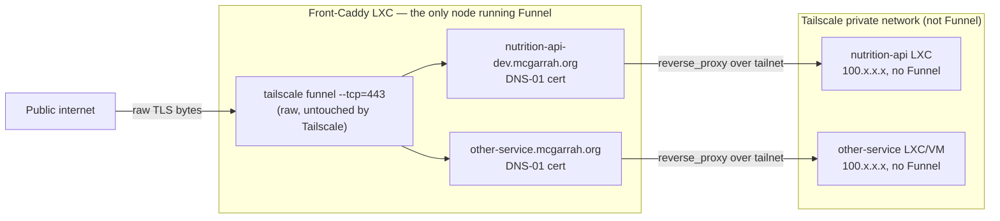

# Plan

Larger pieces of work that are decided in direction but not yet started.
Not a backlog of every idea — see [NOTES.md](NOTES.md) "Ideas not yet acted
on" for those. Items here have enough of a concrete approach that starting
them should mostly be execution, not design.

## Project goals

What this project is *for*, so plan items can be judged against something:

1. **One canonical answer per barcode.** A single `GET /api/v1/lookup/{gtin}`
   that merges USDA FDC (nutrition authority), Open Food Facts (product
   metadata), and GS1 GPC (taxonomy) into one typed, per-100g-normalized
   response — so a consumer never reconciles three vendors themselves.
2. **Honest data, graded confidence.** Provenance, `cached`, and
   `category_hierarchy_source` travel with every response; a verified
   classification is distinguishable from a guess, and a heuristic is never
   dressed up as ground truth (see NOTES.md on GTIN→GPC being inherently
   heuristic).
3. **Fast and cheap by locality.** Local bulk mirrors and layered caches make
   the common request a microsecond disk read, keep the service inside the
   upstreams' rate limits (OFF's 15/min is the binding constraint), and let
   it run on a small self-hosted box.
4. **Degrade, never 500.** Partial answers over outages; the service's
   availability is not the intersection of its upstreams'.
5. **Publicly reachable, defensibly so.** Exposed to the internet (currently
   via Tailscale Funnel) with rate limiting, input caps, a firewalled
   backend, and attribution obligations honored.

## 1. Custom domain (`nutrition-api-dev.mcgarrah.org`) via Tailscale Funnel raw TCP forwarding

**Status:** shelved — revisit once the domain finishes migrating from
Squarespace to Porkbun. Not started.

**Goal:** serve the site at `https://nutrition-api-dev.mcgarrah.org` with a
real, publicly-trusted certificate (no browser warning), while keeping the
properties that made Tailscale Funnel attractive in the first place: no
router port-forwarding, no public IP exposure, no third-party proxy
(Cloudflare) in the request path.

### Why the obvious approaches don't work

- **Plain CNAME to the Funnel `*.ts.net` hostname.** Resolves fine, but TLS
  fails. Tailscale Funnel's default HTTPS mode terminates TLS itself at
  Tailscale's edge using a certificate scoped to your tailnet's own
  `*.ts.net` name — it has no mechanism to obtain or present a cert for an
  arbitrary custom domain. A browser requesting
  `nutrition-api-dev.mcgarrah.org` gets a cert for
  `nutrition-api-dev.squeaker-interval.ts.net` back, the names don't match,
  and the handshake fails (this exact failure is reported upstream:
  [tailscale/tailscale#16478](https://github.com/tailscale/tailscale/issues/16478)).
  Custom-domain support for Funnel is a still-open feature request as of
  2026-07: [tailscale/tailscale#11563](https://github.com/tailscale/tailscale/issues/11563).
- **Cloudflare in front (proxied CNAME).** Would work — Cloudflare terminates
  the custom domain's TLS itself and connects to the `*.ts.net` Funnel URL as
  its origin, sending correct SNI. Explicitly ruled out by the user: don't
  want to move DNS management to Cloudflare or add it to the request path.
- **Drop Funnel, port-forward 80/443 to this LXC, Caddy's own ACME via
  HTTP-01** (`deploy/Caddyfile`'s "Option B", already documented). Works, and
  is the fallback if the approach below doesn't pan out, but reintroduces
  the public-IP/port-forward exposure that Funnel was adopted specifically to
  avoid.

### The approach: Funnel raw TCP forward + Caddy's own DNS-01 cert

Tailscale Funnel has a **raw TCP forwarding mode** that does not terminate
TLS at all — it forwards the encrypted bytes untouched to a local port,
letting the local service (Caddy) perform its own TLS handshake with
whatever certificate it wants. Confirmed against Tailscale's current CLI
reference (`tailscale.com/docs/reference/tailscale-cli/funnel`, fetched
2026-07-17):

```
tailscale funnel --tcp=<port> tcp://localhost:<local-port> [off]
tailscale funnel --tls-terminated-tcp=<port> tcp://localhost:<local-port> [off]
```

**The two TCP flags are easy to confuse and do opposite things:**

- `--tcp=<port>` — **raw** forwarder. "By default, the TCP forwarder forwards
  raw packets." Tailscale does *not* touch TLS; the encrypted stream reaches
  the local backend untouched. **This is the one we want** — it lets Caddy
  see the real ClientHello and terminate TLS itself with a cert matching the
  custom domain.
  It's the same flag used with `--proxy-protocol=2` in Tailscale's own docs
  example (`tailscale funnel --proxy-protocol=2 --tls-terminated-tcp=443
  tcp://127.0.0.1:9899` — note that specific example pairs proxy-protocol
  with the *other* flag, since PROXY protocol there is about preserving the
  original client IP through Tailscale's own termination; don't copy that
  example verbatim, it terminates with the wrong cert for this use case).
- `--tls-terminated-tcp=<port>` — Tailscale terminates TLS using its own
  `*.ts.net`-scoped certificate, then forwards the **decrypted** stream to
  the local backend. This is for TCP protocols that want Funnel's automatic
  HTTPS but don't want to deal with certs themselves (their examples: SSH,
  RDP). **Wrong flag for a custom domain** — would just re-create the
  cert-mismatch problem one layer down.

Allowed Funnel ports either way: `443`, `8443`, `10000` only.

**Why DNS-01, not HTTP-01:** Funnel only forwards those three ports — port 80
is never reachable from the public internet on this box, so Caddy's default
HTTP-01 ACME challenge (which needs port 80) can't complete. Caddy needs a
**DNS-01** challenge instead: it proves domain ownership by creating a TXT
record via the DNS provider's API, which doesn't need any inbound port at
all. Since the domain is moving to Porkbun, this needs a Caddy build with the
Porkbun DNS provider plugin (`github.com/caddy-dns/porkbun`) — either via
`xcaddy build --with github.com/caddy-dns/porkbun` or by selecting it on
caddyserver.com's "Download" page — plus a Porkbun API key/secret with DNS
edit permission for the zone.

### Sketch of the resulting config

```
tailscale funnel --bg --tcp=443 tcp://localhost:8443
```

```caddyfile
nutrition-api-dev.mcgarrah.org {
	tls {
		dns porkbun {
			api_key {env.PORKBUN_API_KEY}
			api_secret_key {env.PORKBUN_API_SECRET}
		}
	}
	bind 127.0.0.1
	listen :8443
	import nutrition_api
}
```

(Exact directive names/shape to be verified against the `caddy-dns/porkbun`
plugin's own docs when this is picked up — not yet checked in this pass.)

### Bonus: single front door for multiple internal services

This pattern generalizes past just this one service, which is worth keeping
in mind given the Proxmox homelab has multiple LXCs/VMs that could each want
a public hostname. The clean version is **one** Caddy instance running
Funnel's raw `--tcp=443` forward, with one site block per custom
domain/subdomain (each getting its own DNS-01 cert), reverse-proxying
internally over the **tailnet's own private network** (MagicDNS names or
`100.x.x.x` addresses — not Funnel, not the public internet) to whichever
LXC/VM actually runs each backend. Only that one front-Caddy node needs
Funnel enabled at all; the backend nodes just need tailnet membership, no
Funnel of their own. Worth a dedicated design pass if/when there's a second
service wanting public exposure — not needed to unblock this one item.



### Open questions before starting

- Exact `caddy-dns/porkbun` Caddyfile directive syntax and whether it needs a
  custom-built Caddy binary replacing the apt-installed one on the reference
  LXC (`deploy/README.md`'s "Install" section currently documents the plain
  apt package, which won't have any DNS plugin compiled in).
  This is the biggest unknown — apt's Caddy build has no DNS providers,
  so switching means either `xcaddy` building locally or an unofficial repo;
  worth evaluating both before committing.
- Whether Porkbun's API is fully live for this zone yet, or still mid-migration
  from Squarespace.
- Confirm no separate Tailscale plan/tier gate exists on `--tcp` raw
  forwarding (nothing found in the docs fetched 2026-07-17, but wasn't
  exhaustively checked against Tailscale's pricing/plan pages).
- Decide whether to keep the existing `:8090` plain-HTTP loopback Funnel
  block (current working `*.ts.net` setup) running alongside this, or replace
  it outright once the custom domain is verified working.

## 2. ~~Name search: stop blocking the event loop, then make it fast (FTS5)~~ — DONE 2026-07-18

**Status:** (a) and (b) both fixed and deployed — `data/fdc.sqlite3` and
`data/off.sqlite3` were rebuilt with `foods_fts`/`products_fts` and are live
on the reference LXC (`nutrition-api.service` restarted), not just merged in
code.

**(a) ~~The search endpoint blocks the event loop~~ — FIXED.** `search_by_name`
in `app/core/search_routes.py` was `async def`, but `search.search_products()`
runs synchronous `sqlite3` queries directly — no thread pool, no
`run_in_executor`. Measured on the reference LXC: a cold-cache
`LIKE '%peanut butter%'` scan over `off.sqlite3` (1.2 GB) took **~17 s**
(≈0.65 s warm). For that whole time the worker's event loop was stalled —
every other request on that worker, including barcode lookups and health
checks, waited. Fixed by making the route `def` instead of `async def` —
FastAPI/Starlette runs a sync path operation in its threadpool automatically,
which is what CLAUDE.md's own rule (async handlers are for *external* I/O)
argues for here anyway, since the work is local blocking disk I/O, not a
network call. Guarded by a regression test
(`test_search_route_is_sync_so_fastapi_runs_it_in_the_threadpool`) that fails
loudly if the route ever goes back to `async def`.

**(b) ~~Leading-wildcard `LIKE` can never use an index~~ — FIXED 2026-07-18.**
Both mirrors were scanned with `LIKE '%q%'`, a full-table scan by
construction. `scripts/build_fdc_db.py` / `build_off_db.py` now build an
FTS5 virtual table (`foods_fts` / `products_fts`, schema_version bumped to
`"2"`) over (`gtin14` UNINDEXED, `description`/`product_name`,
`unicode61 remove_diacritics 2` tokenizer) alongside the real table.
`app/core/search.py` queries FTS5 first — each query word becomes a quoted,
prefix-matched token (`"peanut"*`), ANDed together, ordered by FTS5's `rank`
— and falls back to the old `LIKE` scan when a mirror predates the schema
change (checked via `sqlite_master`, not a version number, so an unrefreshed
mirror degrades gracefully rather than erroring).

Measured against a live copy of the real 1.2 GB OFF mirror, not just the
unit-test fixtures: building the index took **8.7s** and added **~100 MB**
(1.2 GB → 1.3 GB — well under the "few hundred MB" estimate). Query latency:
**9–98 ms** warm (`"organic milk"` 9ms, `"peanut butter"` 24ms, the single
common word `"chocolate"` 98ms — worst case is a single very-frequent word,
since `ORDER BY rank` has to score every match before the `LIMIT`), against
the prior ~17s cold / 0.65s warm `LIKE` scan. Test coverage: new unit tests
for `_fts_match_expr` and the FTS query path in `test_search.py`, and for
the two build scripts' new virtual table in `test_fdc_bulk_import.py` /
`test_build_off_db.py`. Full suite: 804 passed.

Deployed the same day: both mirrors rebuilt (`fdc-2026-04-30` archive
reuploaded in place; `off-2026-07-17` published as a new release, refreshing
the data itself too) and the live service restarted. Live search latency on
the running service measured 25–203ms, matching the synthetic numbers
above. Tokenizer behavior on OFF's non-English/accented product names was
not separately audited — `remove_diacritics 2` should handle the common
case, but this wasn't stress-tested against real multilingual rows.

## 3. Scheduled refresh of the local bulk mirrors

**Status:** not started. Currently a fully manual loop.

OFF republishes daily and FDC twice a year, but refreshing the mirrors
means remembering to run `build_off_db.py` / `build_fdc_db.py
--auto-update`, then `gh release create`/`upload` the `.xz` archives, then
restart the service. Nothing schedules it, so the OFF mirror silently ages
(the one on the reference LXC is `off-2026-07-14` and only that fresh
because it was rebuilt by hand during the nutrient-expansion work).

Sketch: a systemd **timer** on the reference LXC (weekly for OFF — daily is
churn without benefit given the response store absorbs misses; on-release
for FDC, which `--check` already detects) running a script that rebuilds,
verifies row counts against the previous build (a >10% shrink aborts —
upstream export glitches happen), publishes the release asset with
`gh release upload --clobber`, and restarts `nutrition-api.service` off-peak.
Decisions to make when picking this up: whether the LXC (12 GB RAM) is the
right build host or whether a beefier build node should push assets; where
build logs/failures surface (the `/status` dashboard already shows dataset
dates, so staleness is at least *visible* today); and whether to prune old
dated OFF downloads (they are deliberately kept side-by-side today).

## 4. ~~Upgrade the OFF fuzzy GPC matcher to the word-boundary prototype~~ — DONE 2026-07-18

Promoted into `app/core/gpc_match.py` as `fuzzy_hierarchy_for_off_categories`,
replacing `orchestrator._fetch_gpc_categories`'s inline substring-`LIKE`
query. Full detail and real-corpus measurements are in ARCH.md, "GPC
Category Matching" — summary here:

- Built on an FTS5 index over brick descriptions (`bricks_fts`, added to
  `scripts/import_gpc_xml.py`'s schema, same technique as item 2's product
  search) rather than a hand-rolled word index — `ORDER BY rank` (bm25)
  does the "prefer the least common word" job the original prototype did by
  hand, and word-boundary matching comes from FTS5 directly rather than
  needing to be built.
- Tags are tried narrowest-first (`reversed`, capped at `_MAX_TAGS_TRIED =
  8`), fixing the wrong-order bug (old code took the first three — the
  broadest — tags).
- A stopword list (`beverages`, `food`, `products`, `drinks`, plus
  grammatical connectors) built from real frequency counts across ~200k
  OFF products' category tags, not guessed.
- Falls back to a (still stopword-filtered, still narrowest-first) `LIKE`
  scan for a `gpc.sqlite3` built before `bricks_fts` existed, checked via
  `sqlite_master` — the same graceful-degradation pattern as item 2.

**Measured against the real corpus** (random 2,000-product sample of
`data/off.sqlite3`): old matcher 53.1% match rate, of which **18.6% were
literally the documented `Alcoholic Beverages Variety Packs` bug**; new
matcher 93.0% match rate, and a direct check of five real
`en:beverages`-tagged pasta products confirms none produce that wrong
answer any more. **Not measured**: a new overall precision/noise figure to
replace the original 69% — that required the original investigation's
manual case-by-case audit, not repeated here, so treat the higher recall as
real but the precision improvement as plausible-and-partially-verified
rather than fully quantified. The polysemy ceiling (`beans`, `spring`) is
unchanged, as expected — it was never a matching-mechanism problem.

Test coverage: unit tests for `_meaningful_words`/`_fts_match_expr`, an FTS
fixture (`gpc_db_with_fts`) exercising the real query path including a
regression test that `"ola"` (substring of "Cola" but not a token prefix)
does *not* match — the exact class of bug FTS5's prefix matching (vs. the
old substring `LIKE`) rules out — plus the LIKE-fallback path via the
existing `gpc_db` fixture. Full suite: 821 passed.

**Left for later, not blocking:** a real manual precision audit at the
scale of the original investigation (item 5, the `reviewed` tier, is
designed to absorb exactly this kind of review effort once it exists,
rather than repeating a one-off audit here).

## 5. ~~`reviewed` tier for fuzzy GPC matches~~ — DONE 2026-07-18 (mechanism); curation ongoing

**What changed from the original design:** the original sketch here assumed
a live web review workflow — a new SQLite table for (tag → brick, verdict)
pairs, a `POST` endpoint, an extension of `/gpc/mappings` into a review UI.
Investigated before building it and found this API has **zero precedent for
any mutating endpoint** anywhere in `app/` (every route in every router is
`@router.get`), CORS is locked to `allow_methods=["GET"]`, there is no
app-level auth at all (only OS-level firewalling), and the service is
exposed to the public internet via Tailscale Funnel. Adding a write path
there is a real security decision, not a natural extension — raised with
the user, who chose the alternative: **treat OFF tag review exactly like
FDC category curation.** `OFF_TAG_TO_BRICK`/`OFF_TAG_TO_CLASS` in
`gpc_match.py` are hand-verified Python dicts, built and committed the same
way `FDC_CATEGORY_TO_BRICK`/`FDC_CATEGORY_TO_CLASS` were. No new
persistence, no new API surface, no new security question.

**Mechanism, fully shipped:** `category_hierarchy_source` gained `"reviewed"`
as a real (not just reserved) value; `gpc_match.reviewed_hierarchy_for_off_
categories()` walks a product's OFF tags narrowest-first against the two new
tables; the orchestrator's Layer 3 tries it between `fdc_curated` and
`off_fuzzy`, same "curated beats best-effort, skip the rest on a hit"
precedence FDC already had over fuzzy. `/gpc/mappings` (and its UI) got a
second, parallel section — same `CuratedMapping` shape, same live-coverage
pattern, just keyed on OFF tags with a `product_count`/tag-occurrence unit
instead of FDC's `food_count`.

**A real robustness bug found and fixed along the way, not scoped to this
item:** the existing `fdc_curated` resolution in `orchestrator.py` called
`get_db()` and resolved a hierarchy with **no error handling at all** — a
broken or momentarily-unavailable `gpc.sqlite3` at exactly the moment of a
curated hit would have crashed the *entire* product lookup, not degraded
it, unlike every real upstream call in this module. Never exercised in
tests because no existing scenario combined a curated FDC hit with a broken
database. Wiring in the `reviewed` tier broadened when `get_db()` gets
called (now on any product with OFF category tags, not just a curated FDC
hit), which is what surfaced it. Fixed for both tiers at once
(`_timed_gpc_lookup`, mirroring the try/except the fuzzy tier already had),
with regression tests for both.

**A second, adjacent gap found and fixed:** `database.DB_PATH` (the GPC
database) had no autouse test-isolation fixture, unlike `fdc_local`/
`off_local`'s `isolated_fdc_local`/`isolated_off_local`. Latent until this
change, because `get_db()` was called rarely enough in tests without an
explicit `gpc_db` fixture that it never mattered — until broadening when
`get_db()` fires (above) combined with a real collision: the shared
`off_product` test fixture's `en:carbonated-drinks` tag is also a genuine
`OFF_TAG_TO_CLASS` entry, so unisolated tests would have started resolving
against the real `data/gpc.sqlite3` on a developer's box. Added
`isolated_gpc_db` (autouse), same pattern as its two siblings.

**Curation seed, round 1:** 26 brick + 5 class entries, each individually
verified against real product samples and the real GPC taxonomy (not
worked mechanically down the frequency list — OFF's tag-frequency head
skews toward broad umbrella terms unlike FDC's, see ARCH.md's "Curated OFF
tags" section for why). Reached 4.4% of real tag occurrences (296,084 of
6,657,990). Live-verified end to end on a real product (`00000000030489`,
"Moutarde au miel") returning `category_hierarchy_source: "reviewed"`
through the running dev server, not just the test suite.

**Round 2 (same day):** 69 more brick entries — reusing an already-verified
code where an OFF tag names the same real-world thing as an existing entry
(a dozen cheese-style tags all resolve to the one Cheese brick), and fresh
codes, each checked against real samples, for categories with no existing
FDC-curated equivalent (oils, fruit juice, ice cream, cooking sauces,
soups, hummus/dips, sugar, syrups, cereal/protein bars). Caught and fixed
one real mistake via that sample-checking discipline: `en:beef` and
`en:beef-and-its-products` looked at first like Prepared/Processed
(matching FDC's own beef categories), but their actual samples were raw
cuts — moved to Unprepared/Unprocessed, keeping only `en:beef-dishes`
(genuinely prepared meals in its samples) on the other brick. **100 brick +
5 class entries now reach 13.5%** (898,275 of 6,657,990) — 3x round 1's
coverage. Live-verified 5 more real products end to end, including the
beef correction (`British Beef Braising Steak` → `Beef -
Unprepared/Unprocessed`, not the prepared brick).

**Left for later, not blocking:** further curation rounds (the same way
FDC grew from its first pass to 91.4% — the broad umbrella tags at the
head of the frequency distribution remain deliberately uncurated, see
ARCH.md) and a genuine live review workflow, if one is ever actually
wanted for collaborative/non-git-access review — the security question
that ruled it out this round would need a real answer first (an API key?
Caddy-level LAN/tailnet-only gating for just that route, mirroring how
debug endpoints were handled during the earlier
security-hardening pass?).

## 6. Data quality & coverage dashboard

**Status:** not started. Added 2026-07-18, following a review of what already
exists vs. what's missing.

**The audience is a data engineer or data analyst, not an operator.**
`/status` already answers "is the service up" (Caddy, backend, upstream
reachability). This is a different question: "how good is the data we're
actually producing, and where are the gaps" — the thing someone would check
before building an ML feature set on top of this API, or before trusting a
bulk export of it for analysis.

**Most of the underlying capability already exists, scattered.** Before
designing anything new, worth being clear about what this item is and is
not building:

- `GET /api/v1/gpc/mappings` already reports `fdc_curated` and `reviewed`
  coverage (coverage %, curated entry counts, ranked uncovered
  categories/tags) — see items 4 and 5. This is the GPC-matching piece the
  dashboard needs; it's a consumer of that endpoint, not a reimplementation.
- `GET /api/v1/data/{store}/coverage?table=...` already computes per-column
  non-null percentage for any table in any store (`data_browser._sqlite_
  coverage`, mtime-cached) — nutrient field sparsity, dead columns (OFF's
  `allergens` column is a documented 0%), all already queryable. The
  existing `/data` browser UI already surfaces this, but one store/table at
  a time — there's no view that shows all of them together.
- What's genuinely **not** built yet, and is the real new work here:
  1. **A single aggregated view.** Pull the above into one page/endpoint
     instead of requiring someone to click through 4 stores × N tables one
     at a time. Mechanically simple — fan out to the existing functions,
     no new analysis logic.
  2. **Value distributions, not just null-rates.** Non-null coverage
     doesn't catch a column that's 95% populated but suspiciously clustered
     at a single value (e.g. nutrient values bunched at exactly the
     physical-max cutoff `app/core/nutrients.py` enforces, which would mean
     values are being capped rather than reported — worth knowing before
     using a field as an ML input). A histogram/percentile summary per
     numeric column, computed the same cached-by-mtime way as
     `_sqlite_coverage`.
  3. **Cross-source agreement.** For GTINs present in *both* `fdc.sqlite3`
     and `off.sqlite3`, how often do they agree on a given nutrient within
     some tolerance? Touched on manually this session while verifying the
     USDA-ingredients-precedence fix (found real disagreement cases) — this
     item is making that a systematic, queryable statistic instead of a
     one-off manual spot check.
  4. **Upstream vs. mirrored ("external repositories").** Each local mirror
     is a *filtered subset* of what the upstream actually publishes — OFF's
     ~4.5M-row export becomes ~2.24M kept rows (needs barcode + name + a
     usable nutrient), FDC's 2.0M branded records collapse to 442,095
     barcodes. The exclusion counts already get logged during
     `build_off_db.py`/`build_fdc_db.py` runs (`_step()` messages) but
     aren't persisted or queryable afterward — this item means recording
     them (in the mirror's own `*_metadata` table, alongside `dataset`/
     `source_modified`, the same place dataset provenance already lives)
     so "what fraction of upstream did we actually keep, and why" survives
     past the build's own log output.

**Shape:** a new `GET /api/v1/data/analytics` (or similar) endpoint as the
primary deliverable — JSON first, since the stated audience (a data
engineer scripting against this) wants machine-readable output, not just a
page to read. A thin HTML view on top (`/data/analytics` or extending
`/data` with a new tab), consistent with every other page in this app being
a view over its own JSON API, not the other way around.

**Open questions before starting:** whether per-column distributions need
their own cache table (a full percentile computation over 2.24M rows per
numeric column, repeated across dozens of nutrient columns, may not be as
cheap as the existing single-pass null-count query — needs measuring against
the real `off.sqlite3`/`fdc.sqlite3` before committing to "compute on
request, cache by mtime" vs. "compute once at build time, store the
summary"); and how much of "external repositories" should also mean the
*sibling code packages* (`usda-fdc`, `gs1-gpc`, `nutrimetrics`, ...) rather
than just the upstream *data* sources — this item assumes data sources, but
worth confirming before designing the exact scope.

## 7. Automated dependency vulnerability scanning in CI

**Status:** not started. Found during a platform review, 2026-07-18.

`pip-audit` was run once, by hand, during the earlier security-hardening
session (PR #38) — it is not part of `.github/workflows/ci.yml`, which
currently runs flake8, pytest, the node static-page tests, and a Docker
build, nothing dependency-scanning shaped. A CVE disclosed in `fastapi`,
`pydantic`, or any other pinned dependency *after* that one-time check would
never be caught. No Dependabot config either (`.github/dependabot.yml`
doesn't exist).

Sketch: add a `pip-audit` step to the existing `test` job (fails the build
on a known vulnerability, same bar as flake8/pytest already failing it) or
a separate scheduled job (weekly, since a new CVE can appear without any
code change here to trigger CI) — worth deciding which before starting,
since a PR-blocking scan and a scheduled advisory scan serve different
purposes and this codebase doesn't need to choose only one. A minimal
`dependabot.yml` (pip + github-actions ecosystems) covers the "keep
versions current" half separately from the "block on known-bad" half.

## 8. Response store retention

**Status:** not started. Found during a platform review, 2026-07-18.

`app/core/store.py` has `get`/`put` and a `TTL_DAYS` (default 30) that
governs whether a record is still fresh enough to *serve* without
re-fetching — but nothing ever deletes a record past that age. Checked: no
`remove`/`prune`/`cleanup` function exists anywhere in the module. A record
for a barcode nobody looks up again simply stays on disk forever; the
directory can only grow. Small today (76 KB, 27 files on the reference
LXC), but this is a store with no ceiling on a service meant to run
long-term, and `data/` is the one path `nutrition-api.service`'s systemd
sandboxing grants write access to (`ReadWritePaths`) — worth bounding
before it's a real disk-exhaustion question instead of a hypothetical one.

Sketch: a `prune(older_than_days=STORE_TTL_DAYS * N)` function (a multiple
of the serving TTL, not the TTL itself — a record just past 30 days but
still occasionally re-served-stale-then-refreshed is different from one
untouched for 6 months) run from a systemd timer, the same mechanism item 3
already proposes for the mirror rebuilds — a natural place to fold this in
rather than standing up a second scheduling mechanism.

## 9. Curated GPC code staleness check

**Status:** not started. Found during a platform review, 2026-07-18.

`FDC_CATEGORY_TO_BRICK`/`_CLASS` and `OFF_TAG_TO_BRICK`/`_CLASS` hard-code
GPC brick/class codes verified against one specific GS1 taxonomy version at
curation time. `scripts/import_gpc_xml.py` auto-updates the taxonomy when
GS1 publishes a newer one — if GS1 ever retires or renumbers a code between
versions, the corresponding curated entry doesn't error, it just silently
starts resolving to an empty hierarchy (`hierarchy_for_brick`/
`hierarchy_for_class` return `[]` for an unknown code, by design, so an
unresolved *lookup* code degrades gracefully — but an unresolved *curated*
code degrading the same way is a regression nobody would notice, since it
looks identical to "no curated entry exists for this category/tag" rather
than "a curated entry broke"). No check anywhere currently confirms every
curated code still resolves against the *current* live taxonomy.

Sketch: a small script (or a step folded into `import_gpc_xml.py --auto-
update`, right after a successful rebuild) that resolves every code in all
four curated tables against the freshly-imported database and logs/alerts
on any that come back empty — the same verification method already used by
hand while building each table (`hierarchy_for_brick`/`hierarchy_for_class`
against the real `gpc.sqlite3`), just automated and run on every taxonomy
refresh instead of once at curation time.
