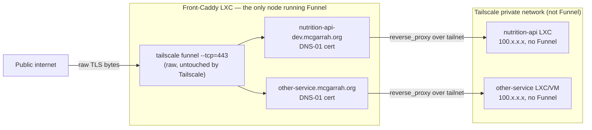

# Plan

Larger pieces of work that are decided in direction but not yet started.
Not a backlog of every idea — see [NOTES.md](NOTES.md) "Ideas not yet acted
on" for those. Items here have enough of a concrete approach that starting
them should mostly be execution, not design.

Three groups below: **Active now** is the current focus. **Longer term** is
real, decided work that isn't being picked up right now — parked, not
abandoned. **Shipped** is completed work, kept for the record of what was
tried, measured, and decided along the way, not just the end state. Item
numbers are stable IDs — referenced elsewhere in the codebase (README.md,
ARCH.md, commit messages) — not a reading or priority order; the section
headings are what's actually being worked on.

## Project goals

What this project is *for*, so plan items can be judged against something:

1. **One canonical answer per barcode.** A single `GET /api/v1/lookup/{gtin}`
   that merges USDA FDC (nutrition authority), Open Food Facts (product
   metadata), and GS1 GPC (taxonomy) into one typed, per-100g-normalized
   response — so a consumer never reconciles three vendors themselves.
2. **Honest data, graded confidence.** Provenance, `cached`, and
   `category_hierarchy_source` travel with every response; a verified
   classification is distinguishable from a guess, and a heuristic is never
   dressed up as ground truth (see NOTES.md on GTIN→GPC being inherently
   heuristic).
3. **Fast and cheap by locality.** Local bulk mirrors and layered caches make
   the common request a microsecond disk read, keep the service inside the
   upstreams' rate limits (OFF's 15/min is the binding constraint), and let
   it run on a small self-hosted box.
4. **Degrade, never 500.** Partial answers over outages; the service's
   availability is not the intersection of its upstreams'.
5. **Publicly reachable, defensibly so.** Exposed to the internet (currently
   via Tailscale Funnel) with rate limiting, input caps, a firewalled
   backend, and attribution obligations honored.

# Active now

Nothing currently in progress — see "Shipped" below for items 8 and 9,
both closed out 2026-07-19. Next up is whatever's picked from "Longer
term."

# Longer term

Real, decided work — not a vague idea — but not being picked up right now.

## 1. Custom domain (`nutrition-api-dev.mcgarrah.org`) via Tailscale Funnel raw TCP forwarding

**Status:** shelved — revisit once the domain finishes migrating from
Squarespace to Porkbun. Not started.

**Goal:** serve the site at `https://nutrition-api-dev.mcgarrah.org` with a
real, publicly-trusted certificate (no browser warning), while keeping the
properties that made Tailscale Funnel attractive in the first place: no
router port-forwarding, no public IP exposure, no third-party proxy
(Cloudflare) in the request path.

### Why the obvious approaches don't work

- **Plain CNAME to the Funnel `*.ts.net` hostname.** Resolves fine, but TLS
  fails. Tailscale Funnel's default HTTPS mode terminates TLS itself at
  Tailscale's edge using a certificate scoped to your tailnet's own
  `*.ts.net` name — it has no mechanism to obtain or present a cert for an
  arbitrary custom domain. A browser requesting
  `nutrition-api-dev.mcgarrah.org` gets a cert for
  `nutrition-api-dev.squeaker-interval.ts.net` back, the names don't match,
  and the handshake fails (this exact failure is reported upstream:
  [tailscale/tailscale#16478](https://github.com/tailscale/tailscale/issues/16478)).
  Custom-domain support for Funnel is a still-open feature request as of
  2026-07: [tailscale/tailscale#11563](https://github.com/tailscale/tailscale/issues/11563).
- **Cloudflare in front (proxied CNAME).** Would work — Cloudflare terminates
  the custom domain's TLS itself and connects to the `*.ts.net` Funnel URL as
  its origin, sending correct SNI. Explicitly ruled out by the user: don't
  want to move DNS management to Cloudflare or add it to the request path.
- **Drop Funnel, port-forward 80/443 to this LXC, Caddy's own ACME via
  HTTP-01** (`deploy/Caddyfile`'s "Option B", already documented). Works, and
  is the fallback if the approach below doesn't pan out, but reintroduces
  the public-IP/port-forward exposure that Funnel was adopted specifically to
  avoid.

### The approach: Funnel raw TCP forward + Caddy's own DNS-01 cert

Tailscale Funnel has a **raw TCP forwarding mode** that does not terminate
TLS at all — it forwards the encrypted bytes untouched to a local port,
letting the local service (Caddy) perform its own TLS handshake with
whatever certificate it wants. Confirmed against Tailscale's current CLI
reference (`tailscale.com/docs/reference/tailscale-cli/funnel`, fetched
2026-07-17):

```
tailscale funnel --tcp=<port> tcp://localhost:<local-port> [off]
tailscale funnel --tls-terminated-tcp=<port> tcp://localhost:<local-port> [off]
```

**The two TCP flags are easy to confuse and do opposite things:**

- `--tcp=<port>` — **raw** forwarder. "By default, the TCP forwarder forwards
  raw packets." Tailscale does *not* touch TLS; the encrypted stream reaches
  the local backend untouched. **This is the one we want** — it lets Caddy
  see the real ClientHello and terminate TLS itself with a cert matching the
  custom domain.
  It's the same flag used with `--proxy-protocol=2` in Tailscale's own docs
  example (`tailscale funnel --proxy-protocol=2 --tls-terminated-tcp=443
  tcp://127.0.0.1:9899` — note that specific example pairs proxy-protocol
  with the *other* flag, since PROXY protocol there is about preserving the
  original client IP through Tailscale's own termination; don't copy that
  example verbatim, it terminates with the wrong cert for this use case).
- `--tls-terminated-tcp=<port>` — Tailscale terminates TLS using its own
  `*.ts.net`-scoped certificate, then forwards the **decrypted** stream to
  the local backend. This is for TCP protocols that want Funnel's automatic
  HTTPS but don't want to deal with certs themselves (their examples: SSH,
  RDP). **Wrong flag for a custom domain** — would just re-create the
  cert-mismatch problem one layer down.

Allowed Funnel ports either way: `443`, `8443`, `10000` only.

**Why DNS-01, not HTTP-01:** Funnel only forwards those three ports — port 80
is never reachable from the public internet on this box, so Caddy's default
HTTP-01 ACME challenge (which needs port 80) can't complete. Caddy needs a
**DNS-01** challenge instead: it proves domain ownership by creating a TXT
record via the DNS provider's API, which doesn't need any inbound port at
all. Since the domain is moving to Porkbun, this needs a Caddy build with the
Porkbun DNS provider plugin (`github.com/caddy-dns/porkbun`) — either via
`xcaddy build --with github.com/caddy-dns/porkbun` or by selecting it on
caddyserver.com's "Download" page — plus a Porkbun API key/secret with DNS
edit permission for the zone.

### Sketch of the resulting config

```
tailscale funnel --bg --tcp=443 tcp://localhost:8443
```

```caddyfile
nutrition-api-dev.mcgarrah.org {
	tls {
		dns porkbun {
			api_key {env.PORKBUN_API_KEY}
			api_secret_key {env.PORKBUN_API_SECRET}
		}
	}
	bind 127.0.0.1
	listen :8443
	import nutrition_api
}
```

(Exact directive names/shape to be verified against the `caddy-dns/porkbun`
plugin's own docs when this is picked up — not yet checked in this pass.)

### Bonus: single front door for multiple internal services

This pattern generalizes past just this one service, which is worth keeping
in mind given the Proxmox homelab has multiple LXCs/VMs that could each want
a public hostname. The clean version is **one** Caddy instance running
Funnel's raw `--tcp=443` forward, with one site block per custom
domain/subdomain (each getting its own DNS-01 cert), reverse-proxying
internally over the **tailnet's own private network** (MagicDNS names or
`100.x.x.x` addresses — not Funnel, not the public internet) to whichever
LXC/VM actually runs each backend. Only that one front-Caddy node needs
Funnel enabled at all; the backend nodes just need tailnet membership, no
Funnel of their own. Worth a dedicated design pass if/when there's a second
service wanting public exposure — not needed to unblock this one item.



### Open questions before starting

- Exact `caddy-dns/porkbun` Caddyfile directive syntax and whether it needs a
  custom-built Caddy binary replacing the apt-installed one on the reference
  LXC (`deploy/README.md`'s "Install" section currently documents the plain
  apt package, which won't have any DNS plugin compiled in).
  This is the biggest unknown — apt's Caddy build has no DNS providers,
  so switching means either `xcaddy` building locally or an unofficial repo;
  worth evaluating both before committing.
- Whether Porkbun's API is fully live for this zone yet, or still mid-migration
  from Squarespace.
- Confirm no separate Tailscale plan/tier gate exists on `--tcp` raw
  forwarding (nothing found in the docs fetched 2026-07-17, but wasn't
  exhaustively checked against Tailscale's pricing/plan pages).
- Decide whether to keep the existing `:8090` plain-HTTP loopback Funnel
  block (current working `*.ts.net` setup) running alongside this, or replace
  it outright once the custom domain is verified working.

## 12. Persist upstream-vs-mirrored exclusion counts

**Status:** not started — split out of item 6's first draft, 2026-07-18,
to give it a proper home instead of staying buried in a "left out" note.

Each local mirror is a *filtered subset* of what the upstream actually
publishes — OFF's ~4.5M-row export becomes ~2.24M kept rows (needs barcode
+ name + a usable nutrient), FDC's 2.0M branded records collapse to 442,095
barcodes. The exclusion counts already get logged during
`build_off_db.py`/`build_fdc_db.py` runs (`_step()` messages) but aren't
persisted or queryable afterward.

Sketch: record them in the mirror's own `*_metadata` table, alongside
`dataset`/`source_modified`, the same place dataset provenance already
lives, so "what fraction of upstream did we actually keep, and why"
survives past the build's own log output — and becomes visible in the Data
Quality dashboard (item 6, shipped) rather than only in a build-time log
line. Needs touching the build scripts, not just a read-side addition,
which is why it was scoped out of item 6's first (read-only) draft.

Also open, resolved for item 6's shipped scope but worth restating if this
is picked up: whether "external repositories" should also cover the
*sibling code packages* (`usda-fdc`, `gs1-gpc`, `nutrimetrics`) — no, this
item means the upstream *data* sources (FDC/OFF/GPC) only. A code-package
staleness angle, if ever wanted, would be a distinct item.

# Shipped

## 2. ~~Name search: stop blocking the event loop, then make it fast (FTS5)~~ — DONE 2026-07-18

**Status:** (a) and (b) both fixed and deployed — `data/fdc.sqlite3` and
`data/off.sqlite3` were rebuilt with `foods_fts`/`products_fts` and are live
on the reference LXC (`nutrition-api.service` restarted), not just merged in
code.

**(a) ~~The search endpoint blocks the event loop~~ — FIXED.** `search_by_name`
in `app/core/search_routes.py` was `async def`, but `search.search_products()`
runs synchronous `sqlite3` queries directly — no thread pool, no
`run_in_executor`. Measured on the reference LXC: a cold-cache
`LIKE '%peanut butter%'` scan over `off.sqlite3` (1.2 GB) took **~17 s**
(≈0.65 s warm). For that whole time the worker's event loop was stalled —
every other request on that worker, including barcode lookups and health
checks, waited. Fixed by making the route `def` instead of `async def` —
FastAPI/Starlette runs a sync path operation in its threadpool automatically,
which is what CLAUDE.md's own rule (async handlers are for *external* I/O)
argues for here anyway, since the work is local blocking disk I/O, not a
network call. Guarded by a regression test
(`test_search_route_is_sync_so_fastapi_runs_it_in_the_threadpool`) that fails
loudly if the route ever goes back to `async def`.

**(b) ~~Leading-wildcard `LIKE` can never use an index~~ — FIXED 2026-07-18.**
Both mirrors were scanned with `LIKE '%q%'`, a full-table scan by
construction. `scripts/build_fdc_db.py` / `build_off_db.py` now build an
FTS5 virtual table (`foods_fts` / `products_fts`, schema_version bumped to
`"2"`) over (`gtin14` UNINDEXED, `description`/`product_name`,
`unicode61 remove_diacritics 2` tokenizer) alongside the real table.
`app/core/search.py` queries FTS5 first — each query word becomes a quoted,
prefix-matched token (`"peanut"*`), ANDed together, ordered by FTS5's `rank`
— and falls back to the old `LIKE` scan when a mirror predates the schema
change (checked via `sqlite_master`, not a version number, so an unrefreshed
mirror degrades gracefully rather than erroring).

Measured against a live copy of the real 1.2 GB OFF mirror, not just the
unit-test fixtures: building the index took **8.7s** and added **~100 MB**
(1.2 GB → 1.3 GB — well under the "few hundred MB" estimate). Query latency:
**9–98 ms** warm (`"organic milk"` 9ms, `"peanut butter"` 24ms, the single
common word `"chocolate"` 98ms — worst case is a single very-frequent word,
since `ORDER BY rank` has to score every match before the `LIMIT`), against
the prior ~17s cold / 0.65s warm `LIKE` scan. Test coverage: new unit tests
for `_fts_match_expr` and the FTS query path in `test_search.py`, and for
the two build scripts' new virtual table in `test_fdc_bulk_import.py` /
`test_build_off_db.py`. Full suite: 804 passed.

Deployed the same day: both mirrors rebuilt (`fdc-2026-04-30` archive
reuploaded in place; `off-2026-07-17` published as a new release, refreshing
the data itself too) and the live service restarted. Live search latency on
the running service measured 25–203ms, matching the synthetic numbers
above. Tokenizer behavior on OFF's non-English/accented product names was
not separately audited — `remove_diacritics 2` should handle the common
case, but this wasn't stress-tested against real multilingual rows.

## 4. ~~Upgrade the OFF fuzzy GPC matcher to the word-boundary prototype~~ — DONE 2026-07-18

Promoted into `app/core/gpc_match.py` as `fuzzy_hierarchy_for_off_categories`,
replacing `orchestrator._fetch_gpc_categories`'s inline substring-`LIKE`
query. Full detail and real-corpus measurements are in ARCH.md, "GPC
Category Matching" — summary here:

- Built on an FTS5 index over brick descriptions (`bricks_fts`, added to
  `scripts/import_gpc_xml.py`'s schema, same technique as item 2's product
  search) rather than a hand-rolled word index — `ORDER BY rank` (bm25)
  does the "prefer the least common word" job the original prototype did by
  hand, and word-boundary matching comes from FTS5 directly rather than
  needing to be built.
- Tags are tried narrowest-first (`reversed`, capped at `_MAX_TAGS_TRIED =
  8`), fixing the wrong-order bug (old code took the first three — the
  broadest — tags).
- A stopword list (`beverages`, `food`, `products`, `drinks`, plus
  grammatical connectors) built from real frequency counts across ~200k
  OFF products' category tags, not guessed.
- Falls back to a (still stopword-filtered, still narrowest-first) `LIKE`
  scan for a `gpc.sqlite3` built before `bricks_fts` existed, checked via
  `sqlite_master` — the same graceful-degradation pattern as item 2.

**Measured against the real corpus** (random 2,000-product sample of
`data/off.sqlite3`): old matcher 53.1% match rate, of which **18.6% were
literally the documented `Alcoholic Beverages Variety Packs` bug**; new
matcher 93.0% match rate, and a direct check of five real
`en:beverages`-tagged pasta products confirms none produce that wrong
answer any more. **Not measured**: a new overall precision/noise figure to
replace the original 69% — that required the original investigation's
manual case-by-case audit, not repeated here, so treat the higher recall as
real but the precision improvement as plausible-and-partially-verified
rather than fully quantified. The polysemy ceiling (`beans`, `spring`) is
unchanged, as expected — it was never a matching-mechanism problem.

Test coverage: unit tests for `_meaningful_words`/`_fts_match_expr`, an FTS
fixture (`gpc_db_with_fts`) exercising the real query path including a
regression test that `"ola"` (substring of "Cola" but not a token prefix)
does *not* match — the exact class of bug FTS5's prefix matching (vs. the
old substring `LIKE`) rules out — plus the LIKE-fallback path via the
existing `gpc_db` fixture. Full suite: 821 passed.

**Left for later, not blocking:** a real manual precision audit at the
scale of the original investigation (item 5, the `reviewed` tier, is
designed to absorb exactly this kind of review effort once it exists,
rather than repeating a one-off audit here).

## 5. ~~`reviewed` tier for fuzzy GPC matches~~ — DONE 2026-07-18 (mechanism); curation ongoing

**What changed from the original design:** the original sketch here assumed
a live web review workflow — a new SQLite table for (tag → brick, verdict)
pairs, a `POST` endpoint, an extension of `/gpc/mappings` into a review UI.
Investigated before building it and found this API has **zero precedent for
any mutating endpoint** anywhere in `app/` (every route in every router is
`@router.get`), CORS is locked to `allow_methods=["GET"]`, there is no
app-level auth at all (only OS-level firewalling), and the service is
exposed to the public internet via Tailscale Funnel. Adding a write path
there is a real security decision, not a natural extension — raised with
the user, who chose the alternative: **treat OFF tag review exactly like
FDC category curation.** `OFF_TAG_TO_BRICK`/`OFF_TAG_TO_CLASS` in
`gpc_match.py` are hand-verified Python dicts, built and committed the same
way `FDC_CATEGORY_TO_BRICK`/`FDC_CATEGORY_TO_CLASS` were. No new
persistence, no new API surface, no new security question.

**Mechanism, fully shipped:** `category_hierarchy_source` gained `"reviewed"`
as a real (not just reserved) value; `gpc_match.reviewed_hierarchy_for_off_
categories()` walks a product's OFF tags narrowest-first against the two new
tables; the orchestrator's Layer 3 tries it between `fdc_curated` and
`off_fuzzy`, same "curated beats best-effort, skip the rest on a hit"
precedence FDC already had over fuzzy. `/gpc/mappings` (and its UI) got a
second, parallel section — same `CuratedMapping` shape, same live-coverage
pattern, just keyed on OFF tags with a `product_count`/tag-occurrence unit
instead of FDC's `food_count`.

**A real robustness bug found and fixed along the way, not scoped to this
item:** the existing `fdc_curated` resolution in `orchestrator.py` called
`get_db()` and resolved a hierarchy with **no error handling at all** — a
broken or momentarily-unavailable `gpc.sqlite3` at exactly the moment of a
curated hit would have crashed the *entire* product lookup, not degraded
it, unlike every real upstream call in this module. Never exercised in
tests because no existing scenario combined a curated FDC hit with a broken
database. Wiring in the `reviewed` tier broadened when `get_db()` gets
called (now on any product with OFF category tags, not just a curated FDC
hit), which is what surfaced it. Fixed for both tiers at once
(`_timed_gpc_lookup`, mirroring the try/except the fuzzy tier already had),
with regression tests for both.

**A second, adjacent gap found and fixed:** `database.DB_PATH` (the GPC
database) had no autouse test-isolation fixture, unlike `fdc_local`/
`off_local`'s `isolated_fdc_local`/`isolated_off_local`. Latent until this
change, because `get_db()` was called rarely enough in tests without an
explicit `gpc_db` fixture that it never mattered — until broadening when
`get_db()` fires (above) combined with a real collision: the shared
`off_product` test fixture's `en:carbonated-drinks` tag is also a genuine
`OFF_TAG_TO_CLASS` entry, so unisolated tests would have started resolving
against the real `data/gpc.sqlite3` on a developer's box. Added
`isolated_gpc_db` (autouse), same pattern as its two siblings.

**Curation seed, round 1:** 26 brick + 5 class entries, each individually
verified against real product samples and the real GPC taxonomy (not
worked mechanically down the frequency list — OFF's tag-frequency head
skews toward broad umbrella terms unlike FDC's, see ARCH.md's "Curated OFF
tags" section for why). Reached 4.4% of real tag occurrences (296,084 of
6,657,990). Live-verified end to end on a real product (`00000000030489`,
"Moutarde au miel") returning `category_hierarchy_source: "reviewed"`
through the running dev server, not just the test suite.

**Round 2 (same day):** 69 more brick entries — reusing an already-verified
code where an OFF tag names the same real-world thing as an existing entry
(a dozen cheese-style tags all resolve to the one Cheese brick), and fresh
codes, each checked against real samples, for categories with no existing
FDC-curated equivalent (oils, fruit juice, ice cream, cooking sauces,
soups, hummus/dips, sugar, syrups, cereal/protein bars). Caught and fixed
one real mistake via that sample-checking discipline: `en:beef` and
`en:beef-and-its-products` looked at first like Prepared/Processed
(matching FDC's own beef categories), but their actual samples were raw
cuts — moved to Unprepared/Unprocessed, keeping only `en:beef-dishes`
(genuinely prepared meals in its samples) on the other brick. **100 brick +
5 class entries now reach 13.5%** (898,275 of 6,657,990) — 3x round 1's
coverage. Live-verified 5 more real products end to end, including the
beef correction (`British Beef Braising Steak` → `Beef -
Unprepared/Unprocessed`, not the prepared brick).

**Left for later, not blocking:** further curation rounds (the same way
FDC grew from its first pass to 91.4% — the broad umbrella tags at the
head of the frequency distribution remain deliberately uncurated, see
ARCH.md) and a genuine live review workflow, if one is ever actually
wanted for collaborative/non-git-access review — the security question
that ruled it out this round would need a real answer first (an API key?
Caddy-level LAN/tailnet-only gating for just that route, mirroring how
debug endpoints were handled during the earlier
security-hardening pass?).

## 6. Data quality & coverage dashboard

**Status:** first draft shipped 2026-07-18 (items 1-2 below). Round 2 shipped
2026-07-18: item 3 (cross-source agreement) plus an OFF outlier fix the first
draft's own histogram work surfaced. The remaining deferred piece (item 4,
upstream-vs-mirrored exclusion counts) was split out to its own longer-term
item — see item 12, above.

**The audience is a data engineer or data analyst, not an operator.**
`/status` already answers "is the service up" (Caddy, backend, upstream
reachability). This is a different question: "how good is the data we're
actually producing, and where are the gaps" — the thing someone would check
before building an ML feature set on top of this API, or before trusting a
bulk export of it for analysis.

**Most of the underlying capability already exists, scattered.** Before
designing anything new, worth being clear about what this item is and is
not building:

- `GET /api/v1/gpc/mappings` already reports `fdc_curated` and `reviewed`
  coverage (coverage %, curated entry counts, ranked uncovered
  categories/tags) — see items 4 and 5. This is the GPC-matching piece the
  dashboard needs; it's a consumer of that endpoint, not a reimplementation.
- `GET /api/v1/data/{store}/coverage?table=...` already computes per-column
  non-null percentage for any table in any store (`data_browser._sqlite_
  coverage`, mtime-cached) — nutrient field sparsity, dead columns (OFF's
  `allergens` column is a documented 0%), all already queryable. The
  existing `/data` browser UI already surfaces this, but one store/table at
  a time — there's no view that shows all of them together.
- What's genuinely **not** built yet, and is the real new work here:
  1. **A single aggregated view.** Pull the above into one page/endpoint
     instead of requiring someone to click through 4 stores × N tables one
     at a time. Mechanically simple — fan out to the existing functions,
     no new analysis logic.
  2. **Value distributions, not just null-rates.** Non-null coverage
     doesn't catch a column that's 95% populated but suspiciously clustered
     at a single value (e.g. nutrient values bunched at exactly the
     physical-max cutoff `app/core/nutrients.py` enforces, which would mean
     values are being capped rather than reported — worth knowing before
     using a field as an ML input). A histogram/percentile summary per
     numeric column, computed the same cached-by-mtime way as
     `_sqlite_coverage`.
  3. **Cross-source agreement.** For GTINs present in *both* `fdc.sqlite3`
     and `off.sqlite3`, how often do they agree on a given nutrient within
     some tolerance? Touched on manually this session while verifying the
     USDA-ingredients-precedence fix (found real disagreement cases) — this
     item is making that a systematic, queryable statistic instead of a
     one-off manual spot check.
  4. **Upstream vs. mirrored ("external repositories").** Each local mirror
     is a *filtered subset* of what the upstream actually publishes — see
     item 12 (longer term) for the full writeup; split out of this item's
     first draft rather than kept as a buried note.

**Shipped:** `GET /api/v1/data/analytics` (`app/core/analytics.py`) — one
JSON payload combining source provenance (FDC/OFF/GPC dataset identity,
freshness, size), per-nutrient FDC-vs-OFF coverage (all 36 fields from
`nutrients.NUTRIENTS`, matched by column name since both mirrors are built
from the same tuple), and the two GPC coverage reports (`fdc_curated`,
`reviewed`) side by side — JSON-first, since the stated audience (a data
engineer scripting against this) wants machine-readable output before a
page to read. Plus two new general-purpose `data_browser.py` primitives,
not analytics-specific: `GET /api/v1/data/{store}/numeric-columns` and
`GET /api/v1/data/{store}/histogram?column=...&bins=...` — usable for any
numeric column in any store, not just the ones the dashboard picks.

The dashboard (now the "Data Quality" tab of `/data`, see item 11) consumes
all of the above: stat tiles, per-source cards, two coverage gauges, an
FDC-vs-OFF bar comparison for every nutrient field, and an on-demand
histogram explorer (pick a store + column, get both mirrors' distributions
side by side).

**A real finding the histogram work surfaced immediately, live on the real
data:** `off.sqlite3`'s raw `calories_kcal` column contains a value of
**1.4 × 10¹⁶** — a single garbage row, invisible to a pure null-rate check
(the column is 97.1% non-null, looks perfectly healthy by that measure
alone) but exactly the kind of thing a value-distribution check exists to
catch. A naive equal-width histogram would have been destroyed by it (every
bucket empty except the one holding this single value) — the shipped
`_sqlite_histogram` bins over the 1st-99th percentile range instead
(computed via SQLite's offset-into-sorted-order trick, since it has no
native `PERCENTILE_CONT`), reporting `below_range`/`above_range` counts
explicitly rather than hiding what got clipped. This value is stored raw in
the mirror and would be caught by `app/core/nutrients.py`'s physical-max
check at lookup time — this dashboard is looking at data *before* that
filter runs, which is the point: it shows what the raw local copy actually
contains, not what a caller of `/api/v1/lookup` would ever see.

**A second finding worth surfacing here, not buried in a commit message:**
`gpc_match.coverage_report()`/`off_tag_coverage_report()` had no caching at
all — `GET /api/v1/data/analytics` was taking ~11s on *every* request
because it re-scanned the entire `off.sqlite3.categories` column (a
1-3s full-table operation) every single time through `off_tag_coverage_
report()`. Fixed with the same mtime-keyed cache pattern `data_browser.py`
already uses (`_mtime_cached` in `gpc_match.py`) — cold request still ~11s,
warm requests ~55ms. This also quietly speeds up the GPC Mappings tab of
`/data`, which called the same uncached functions and had the same latent
cost.

**Performance characteristics, measured against the real corpus, not
estimated:** `coverage()` for `off.sqlite3` (all 36+ columns, 2.24M rows) is
part of the ~11s cold `/api/v1/data/analytics` cost, then cached by mtime.
A single histogram is more expensive than coverage — the percentile
computation requires a sort — measured at **~14-16s cold** for
`off.sqlite3.calories_kcal` specifically (2.17M non-null values), ~2.5s for
the equivalent `fdc.sqlite3` column (390K rows). This is why histograms are
lazy/on-demand in the UI (computed only when a user picks a column, not
precomputed for every nutrient on page load) rather than "compute once at
build time" — the open question in the original design about which
caching strategy to use is resolved by measurement: request-time + mtime
cache is fine for an occasionally-visited dashboard, since the cost lands
once per data refresh, not once per page load. (This cold-cache cost is
also why the `/data` explorer shows a "still working" note and progress
bar past ~2.2s of loading — see item 11.)

**Round 2: the OFF outlier fix.** The 1.4×10¹⁶ `calories_kcal` garbage row
above wasn't a one-off — measuring `nutrients.is_physically_possible()`
directly against both raw mirrors showed `fdc.sqlite3` at 0 implausible
rows across all 36 fields (because `build_fdc_db.py` already calls
`from_usda()`, the full plausibility/cross-nutrient filter, at build time)
versus `off.sqlite3` at thousands per field for ~30 of 36 fields (3611 bad
`calories_kcal` rows, 351 bad `fat`, 240 bad `protein`, ...) — because
`build_off_db.py` only ever used `from_off()` as a boolean keep-the-row
gate, then stored the field's *raw*, unfiltered value regardless of
whether `from_off()` itself had dropped it. Fixed by storing `NULL`
instead of the raw value for any field `from_off()`'s output doesn't
contain — reusing its existing plausibility and cross-nutrient checks
(`_enforce_subsets`, `_reconcile_energy`) rather than duplicating range
logic, confirmed safe because those two only ever delete keys, never add
synthetic ones. `off.sqlite3` schema_version bumped 2 → 3; a rebuild
(`scripts/build_off_db.py`) is required to pick this up — done 2026-07-18,
verified 0 implausible values across all 36 fields post-rebuild.

**Round 2: cross-source agreement**, item 3 from the original list — for
GTINs present in *both* local mirrors, how often do FDC and OFF agree on a
nutrient value (within 15% of the larger figure, a documented/adjustable
choice, not a regulatory tolerance)? Implemented as a single JOIN + `SUM
(CASE ...)` pass over both mirrors at once (`analytics._cross_source_
compute()`), the same "one scan, many expressions" shape as the coverage/
histogram primitives, ~6.6s cold for all 36 fields against the real
2.24M/442K-row mirrors, then cached by both files' mtimes.

**A real bug this surfaced before it shipped, worth recording:**
`fdc.sqlite3` stores nutrients in their *published* unit (mg/µg, since
`build_fdc_db.py` runs `from_usda()` at build time), but `off.sqlite3`
stores them in OFF's *native* unit — raw grams per 100g for every field,
including the 26 of 36 that we publish in mg or µg (`from_off()`'s
gram→mg/µg conversion runs at lookup time, not build time). The first cut
of `_cross_source_compute()` compared these two columns directly with no
conversion; live spot-checks showed exact 1000×/1,000,000× ratios on
"disagreeing" pairs (FDC phosphorus 213.0 vs. OFF 0.213) rather than
genuine data variance. Fixed with a new public `nutrients.off_raw_to_
published_scale(field)` helper (1000 for the mg group, 1e6 for the µg
group, 1 otherwise), applied to OFF's side of the SQL comparison. Real,
corrected agreement figures against the live mirrors: macros agree most
often (`trans_fat` 99.2%, `cholesterol` 90.2%, `calories_kcal` 86.9%,
`protein` 85.1%), micronutrients measurably less (`thiamin` 15.9%,
`folate` 14.7%) — plausibly real measurement/reporting variance between
independently-sourced small values, not an artifact, now that the unit
mismatch is fixed.

**A hypothesis checked and ruled out for this dataset:** `carbohydrates`
disagrees on 6,088 of 41,876 matched pairs (85.5% agreement) — a plausible
suspect is the US/EU labelling split `nutrients.py` already documents
elsewhere (`_NUTRIENT_SUBSETS`'s comment on why fibre is deliberately not
checked against carbohydrate as a subset): the US "Total Carbohydrate by
difference" includes fibre, EU-style labels report carbohydrate net of
fibre. Tested directly against the live mirrors: only 4.3% of the
disagreeing pairs fit that signature (`fdc_carbs − off_carbs ≈ off_fiber`),
and across all 36,503 matched pairs with OFF fibre present, adding OFF's
fibre back made the gap to FDC's figure *worse* for 61% of pairs and
better for only 9% (median unadjusted diff is already 0.000). Read: since
`fdc.sqlite3` is USDA-only (US branded foods), every barcode-matched OFF
row is describing the same US-labelled package, not an independently
EU-labelled one — the convention split is real (and correctly why
`_enforce_subsets` skips fibre) but doesn't apply to this particular
overlap set, so it isn't the explanation for the carbohydrate
disagreement here. Not yet investigated: the actual cause (spot-checked
rows look more like barcode reuse/wrong-product mapping or OCR/crowd-entry
typos than a systematic offset).

## 11. ~~Consolidate the ad-hoc explorer/debug pages into one coherent set~~ — DONE 2026-07-19

**Status:** shipped 2026-07-19. Flagged the same day: these pages were added
one at a time, each to support whatever was being developed at the time,
never designed as a set — the user's framing is that this is a debugging/
dev feature that was "just thrown together," and it read that way to
someone landing on the site new.

**What shipped, against the decided design below:** `/gpc`, `/gpc/mappings`,
and `/data/analytics` are now tabs of one page at `/data` (Data Browser,
Data Quality, GPC Taxonomy, GPC Mappings — `?tab=` picks the initial one,
`history.replaceState` keeps the URL in sync with clicks), with the three
former routes redirecting there for backward compatibility. Every panel's
own ids were namespaced (`db-`/`dq-`/`gt-`/`gm-` prefixes) and its script
wrapped in an IIFE so the four merged pages' identically-named globals
(`$`, `esc`, `api`, `state`, `init`) can't collide; each panel's first fetch
is lazy (fires on that tab's first activation, not on page load), so
visiting one tool doesn't silently also pay for the other three's queries.
Shared nav shipped as a small `nav.js` (`deploy/site/`, plus a FastAPI
`/nav.js` fallback route for the documented no-Caddy local-dev workflow),
replacing the hand-written, inconsistent `<span class="nav">` line each
page carried before. `/status` stayed out, per decision 1 below. The home
page's "More tools" grid (both `app/static/index.html` and the actually-
live `deploy/site/index.html` — a duplication found and fixed along the
way, not in the original design) regrouped into "Explore the data" (one
tile now) and "Operate."

**Follow-up shipped the same day:** a cold local-mirror scan right after a
rebuild/restart could take noticeably longer than the typical 2-3s with no
sign it was still working (see item 6's performance notes). Added a shared
`showLoading()` helper: the plain message shows immediately, and upgrades
in place after 2.2s (past what any cached call takes) to an explicit "still
working, can take up to 15s" note plus an indeterminate progress bar.
Verified with Playwright that the upgrade fires past the threshold and not
before, and doesn't false-positive on a normal fast load. Also, on request,
scrubbed every remaining internal doc/file reference (`PLAN.md item N`,
`ARCH.md`, `app/core/gpc_match.py`, `OFF_TAG_TO_BRICK`) from the page's
user-visible text — this site is public, and a repo-internal reference means
nothing to a visitor who can't see the source. API contract values
(`reviewed`, `off_fuzzy`) and data column names (`branded_food_category`)
were kept, since those are meaningful regardless of audience.

### The problem, measured, not just felt

Eight pages made up the browser-facing surface before this shipped:

| Page | Route | Purpose |
|---|---|---|
| Home | `/` | Entry point: barcode lookup vs. name search, plus a "More tools" grid |
| Barcode lookup | `/lookup` | Look up one GTIN, see the merged Nutrition Facts card |
| Name search | `/search` | Search local FDC/OFF copies by name, then lookup (item 2) |
| GPC taxonomy browser | `/gpc` | Browse Segment → Family → Class → Brick → Attributes |
| GPC mapping viewer | `/gpc/mappings` | Curated FDC/OFF-category → GPC-code mappings, resolved, with coverage (items 4/5) |
| Data Browser | `/data` | Raw schema/rows/column-coverage over the 4 local stores |
| Data Quality Dashboard | `/data/analytics` | Aggregated coverage, value distributions, cross-source agreement (item 6) |
| Status | `/status` | Caddy/backend/upstream health |

Each page hand-wrote its own `<span class="nav">...</span>` footer-nav line
— copy-pasted per file, not a shared component — and the six that shared
the pattern (`/lookup` used a slightly different inline format) each linked
a *different* subset of the others, in different order, with different
labels for the same target. Checked line by line, not estimated:

- **`/gpc` was labelled three different ways** across the pages that linked
  it at all: "GPC taxonomy" (`data.html`, `gpc_mappings.html`), "GPC"
  (`search.html`), "GPC browser" (`lookup.html`) — and `data_analytics.html`
  didn't link it at all.
- **`/data` (Data Browser) was missing from `gpc.html` and `lookup.html`'s
  nav entirely.**
- **`/status` appeared in only 2 of 6** navs (`data.html`,
  `data_analytics.html`); `/docs` appeared in only 1 (`gpc.html`, plus
  `lookup.html`'s own differently-formatted footer).
- **`/data/analytics`, the newest and most substantial page (item 6), was
  missing from `index.html`'s "More tools" grid entirely** — reachable only
  by already being on another explorer page, or by typing the URL.
- `deploy/site/status.html` was the structural odd one out: a Caddy-served
  static file under `deploy/site/`, on a completely different deploy path
  from the other seven, which were all `app/static/*.html` served through
  `main.py` `FileResponse` routes — despite matching the same CSS
  custom-property design language, it was maintained and shipped separately.

None of this was a functional bug — every page still worked, every link
that existed still resolved — it was discoverability and coherence: there
was no single place that told a newcomer "here are the N things you can do
here," grouped by what they're for.

### Decisions

Resolved directly with the user, 2026-07-19:

1. **`/status` stays out of this entirely.** Different audience (operator,
   not data explorer) and a different deploy path already
   (`deploy/site/`, Caddy-served, not an `app/static/` FastAPI page) —
   left exactly as it is today, untouched by this item.
2. **Shared nav: the small vanilla-JS include, not a move to Jinja2
   templates.** One `nav.js` exporting a `{href, label, group}` array,
   injected into a placeholder element on every remaining page. Since
   `/status` is out (decision 1), `status.html` keeps its own hand-written
   nav — it was never going to join the shared component anyway.
3. **All four data-exploration pages merge into *one* page, as tabs** —
   not two separate tabbed pages (`/data`+`/data/analytics` kept apart from
   `/gpc`+`/gpc/mappings`), but a single page with four tabs: **Data
   Browser** (today's `/data`), **Data Quality** (today's
   `/data/analytics`), **GPC Taxonomy** (today's `/gpc`), **GPC Mappings**
   (today's `/gpc/mappings`). One destination for "explore the local data,"
   not four separately-routed lenses on it.
4. **Home page grouping**: `index.html`'s flat "More tools" grid becomes
   labelled sections instead of one undifferentiated grid — **Use the API**
   (`/lookup`, `/search`, already the page's primary "choices" cards,
   unchanged) and **Explore the data** (one tile now, linking to the
   consolidated tabbed page, replacing today's four separate `/gpc`,
   `/gpc/mappings`, `/data`, `/data/analytics` tiles). `/status`, `/docs`,
   `/redoc`, and the example lookup stay together, same spirit as today's
   "API" section.

### Implementation

- **Route**: the consolidated page lives at `/data` — the former Data
  Browser route, kept stable since it was the most centrally-linked of the
  four. `/gpc`, `/gpc/mappings`, and `/data/analytics` are thin redirects in
  `main.py` to `/data?tab=taxonomy`, `?tab=mappings`, `?tab=quality`
  respectively, so every existing bookmark or link still resolves. `/data`
  with no query param defaults to the Data Browser tab, matching that URL's
  behavior before this shipped.
- **Page structure**: the page has a tab strip at the top — four buttons,
  reading `?tab=` on load to preselect and updating the URL via
  `history.replaceState` on click (bookmarkable, no full reload). Each
  tab's markup/JS is the four former pages' bodies, carried over largely
  as-is into four panel `<div>`s (inactive panels `display: none`) —
  consolidating existing, working code into one shell rather than
  rewriting any tool's functionality.
- **Shared nav**: `deploy/site/nav.js` (plus a FastAPI `/nav.js` fallback
  route for local dev without Caddy in front), rendered into a
  `<span id="nav"></span>` placeholder on `index.html`, `lookup.html`,
  `search.html`, and the consolidated page — replacing every hand-written
  `<span class="nav">` line on those four. `status.html` is explicitly
  excluded per decision 1.
- **Slow-load indicator** (follow-up, same day): `showLoading()`, declared
  in the page's shared (unwrapped) tab-controller script so all four
  panels can call it, wired into each panel's slow-path entry point.

## 10. ~~Advanced filters for `/search` and `/lookup`~~ — DONE 2026-07-19

**Status:** shipped 2026-07-19.

**What shipped:** a source-scope filter for both endpoints — `sources=both`
(default) / `fdc` / `off` — plus `/search`'s UI exposing its already-
existing `limit` param. Both pages gained a closed-by-default
`<details>` "Advanced" disclosure (`.adv`/`.adv-row`, styled with each
page's own existing tokens) so the common one-field case is unchanged.

**API**: `orchestrator.lookup(gtin, fresh=False, sources="both")` and
`search.search_products(query, limit=..., sources="both")`. An excluded
source is skipped entirely — no local-mirror read, no live-API call, not
filtered out of a merged result afterward — so a `sources=off` lookup also
skips the GPC `fdc_curated` tier (which needs FDC's own category) and a
`sources=fdc` lookup skips the `reviewed`/`off_fuzzy` tiers (which need
OFF's tags), same as if that source had genuinely returned nothing.

**A caching bug caught before it shipped:** the in-memory lookup cache is
keyed only on GTIN, not on `sources` — a naive implementation would have
let a `sources=fdc` lookup's partial (FDC-only) result get cached and then
silently served to a later *unscoped* request for the same GTIN, quietly
dropping the OFF/GPC data that caller expected. Fixed by only reading from
or writing to the cache when `sources == "both"`; a scoped lookup always
re-fetches, exactly like `fresh=True` already forces, but without needing
`fresh` to also mean "and don't populate the cache for other callers."
Regression test (`test_a_scoped_lookup_is_never_cached_nor_reads_the_
cache`) exercises both directions.

**Deliberately not built this round**, per the item's own original
"candidates to weigh, not commitments" list:
- A "local mirrors only, never fall through to a live upstream" toggle for
  `/lookup` — the inverse of `fresh`.
- A brand/category filter for `/search` — `search.py` has no column
  support for it yet.

Verified with Playwright against the real local mirrors: the Advanced
panel is closed by default on both pages; `sources=fdc`/`sources=off`
correctly change the outgoing request and the rendered result (source
badges on `/lookup`, source labels on `/search`); `/search`'s `limit`
field is honored end to end.

## 8. ~~Response store retention~~ — DONE 2026-07-19

**Status:** shipped 2026-07-19.

**What shipped:** `store.prune(older_than_days=None, dry_run=False)` —
removes any record past `STORE_PRUNE_AFTER_DAYS` (env-overridable, default
`STORE_TTL_DAYS * 3` = 90 days), plus anything with an unreadable payload or
an untrustworthy (naive) timestamp, since `get()` already refuses to serve
either of those and a record nobody will ever be served again is worth zero
regardless of age. Deliberately a *multiple* of the serving TTL, not the TTL
itself, per the original sketch — a record just past the 30-day serving TTL
is stale (`get()` won't return it) but still recently useful, and deleting
it that early would erase the re-fetch-avoidance the store exists for.
`prune()` has no `STORE_ENABLED` gate of its own — an operator running it
explicitly should get an honest answer about what's on disk, not a silent
no-op — and it also cleans up the now-empty two-level shard directories it
leaves behind, so `data/responses/` doesn't accumulate thousands of dead
leaf directories over the service's lifetime.

**Shipped as a periodic sweep, not inline logic**, the same split
`import_store_to_sqlite.py` already uses for the corpus-export side of this
store: `scripts/prune_response_store.py` (with `--dry-run` and
`--older-than`, mirroring `build_off_db.py --check`'s "preview before you
commit" pattern) plus `deploy/nutrition-api-prune.service` +
`.timer` (weekly, `Persistent=true` so a missed run catches up, same
sandboxing as `nutrition-api.service`). Item 3 (longer term, scheduled
mirror refresh) sketched sharing one timer for both jobs — not picked up
since item 3 itself is still parked; this ships as its own standalone
timer, per the original sketch's documented fallback.

9 new tests (`test_store.py`), full suite green, flake8 clean. Live-verified
with `--dry-run` against the real `data/responses/` corpus (27 records, 0
prunable — all well within the 90-day window).

## 9. ~~Curated GPC code staleness check~~ — DONE 2026-07-19

**Status:** shipped 2026-07-19.

**What shipped:** `scripts/import_gpc_xml.py`'s `check_curated_codes(db_path)`
resolves every code in all four curated tables
(`FDC_CATEGORY_TO_BRICK`/`_CLASS`, `OFF_TAG_TO_BRICK`/`_CLASS`) against the
just-imported database — a plain `SELECT brick_code FROM bricks` /
`SELECT class_code FROM classes` existence check, not the full
`hierarchy_for_brick`/`hierarchy_for_class` join, since only "does this
code still exist" needs answering here, not the hierarchy text. Wired into
`_run_import()` right after a successful build (real import only — the
`--auto-update` early-return path when GS1 has nothing newer never reaches
it, correctly, since nothing changed to re-check).

**A design call worth recording:** a stale code is logged as a `WARNING`,
not turned into a non-zero exit code. `import_gpc_xml.py --auto-update`
already runs on *every app startup* (`app/main.py`'s `lifespan`), and a
non-zero exit there is already caught and logged as "GPC auto-update
failed... continuing with existing data" — conflating a genuinely stale
curated code (a curation-maintenance signal; the import itself succeeded)
with an actual import failure would misreport a successful rebuild as
broken on every subsequent startup log line. The log line is the alert;
the exit code still means "did the import itself succeed."

Needed adding `from app.core import gpc_match` to a script that previously
had zero `app.*` dependencies — safe, since `gpc_match.py` itself only
imports `re`/`sqlite3` at module level, the same lightweight-import
property `import_store_to_sqlite.py` already relies on for `app.core.store`.
This also required copying `gpc_match.py` (and its two empty `__init__.py`
package markers) into the Dockerfile's builder stage — that stage bakes
the GPC database at build time using only `scripts/` and the bundled XML,
never `app/`, and the new import broke that build (`ModuleNotFoundError:
No module named 'app'`) until fixed. Verified with a local `--no-cache`
Docker build.

3 new tests (`test_gpc_importer.py`), full suite green (901), flake8
clean. Live-verified two ways: `check_curated_codes()` against the real
`data/gpc.sqlite3` and the real curated tables (0 stale, as expected —
they were all verified against this taxonomy version at curation time),
and a full `import_gpc_xml.py` run against a scratch database using the
real cached `data/imports/en-v20260520.xml`, confirming the check fires
automatically as part of the normal build/log flow.

## 7. ~~Automated dependency vulnerability scanning in CI~~ — DONE 2026-07-19

**Status:** shipped 2026-07-19. Both sketched options built, per the
original "this codebase doesn't need to choose only one" reasoning.

**What shipped:** a `pip-audit` step added to `ci.yml`'s existing `test`
job (PR-blocking, same bar flake8/pytest already hold the build to), plus
a separate `.github/workflows/dependency-audit.yml` running the identical
check weekly (Mondays 06:00 UTC, plus `workflow_dispatch` for an on-demand
run right after a new CVE is disclosed) — the PR-blocking scan only ever
re-checks a PR's exact dependency set at the moment it's opened, so a CVE
disclosed against an already-merged, already-pinned dependency needs the
schedule to ever get noticed, since no code change here would trigger CI
to look again. `pip-audit` itself is now a pinned `requirements-dev.txt`
entry rather than an ad-hoc install, so `pip install -r requirements-dev.
txt` is enough for both workflow steps and a local run.

**`.github/dependabot.yml`** covers the separate "keep versions current"
half (a dependency can be current with no known CVE, or outdated with
none either — different question from what `pip-audit` answers): `pip`
and `github-actions` ecosystems, per the original sketch, plus `docker`
for the Dockerfile's `python:3.13-slim` base image — a real dependency
surface this project has that the original two-ecosystem sketch didn't
call out, added since Dependabot supports it natively and the project
already ships a Docker image.

**Checked, not assumed: no JavaScript dependency surface exists to add.**
No `package.json`, no `node_modules`, no CDN-hosted `<script>` anywhere in
the repo — `jstests/` (the static-page test suite) uses only Node's own
built-in `node:test`/`node:assert`/`node:fs`/`node:path`/`node:vm`
modules. A JS-focused scanner would have nothing to scan.

Both new workflow YAML files validated (`yaml.safe_load`). `pip-audit -r
requirements.txt -r requirements-dev.txt` run live against this project's
actual pinned dependencies: no known vulnerabilities found in either
file, so wiring this in doesn't fail the build it ships in. Full suite
green (910), flake8 clean, 15/15 node tests.

## 3. ~~Scheduled refresh of the local bulk mirrors~~ — DONE 2026-07-19

**Status:** shipped 2026-07-19.

**What shipped:** `scripts/refresh_mirrors.py`, run weekly by
`nutrition-api-refresh.timer`. For each mirror (OFF, FDC): records the
installed dataset + row count, runs `build_X_db.py --auto-update` as a
subprocess, and if the dataset actually changed, checks the new row count
against the pre-rebuild baseline — a shrink past 10% restores the previous
database and archive from a backup taken before the rebuild ("a >10%
shrink aborts" from the original sketch, made real: the bad build is
undone, not merely logged). A build that passes gets published as a
GitHub release (`gh release create`, or `upload --clobber` if the tag
already exists). If anything actually rebuilt, `nutrition-api.service` is
restarted once at the end.

**Decisions made, per the sketch's own open questions:** this LXC (12 GB
RAM) is the build host — no separate build node, since the actual
measured cost (a cold OFF rebuild: ~7 min, ~211 MB peak RSS) doesn't
justify one. Weekly for both mirrors, not just OFF — FDC's own
`--auto-update` no-ops in seconds when nothing's newer, so checking it on
the same cadence costs nothing extra and avoids a second timer. Old dated
OFF downloads are left exactly as they were (deliberately kept
side-by-side already, per `build_off_db.py`'s own design) — out of scope
here. Item 8's prune timer already shipped standalone by the time this
was picked up, so this is its own timer too, not folded together.

**A real gap this surfaced immediately, live:** `off-2026-07-18` (this
session's rebuild for item 6's outlier-storage fix) had never been
published as a release — `gh release list` still showed `off-2026-07-17`
as latest. `build_*.py`'s own `download_release()` only ever *reads* a
published release; nothing in either script, or in the by-hand loop this
replaces, ever *published* one automatically. Added a self-heal check:
even when `--auto-update` finds nothing to rebuild, `refresh_mirrors.py`
now also checks whether the *currently-installed* dataset has a published
release, and publishes it if not — covers a previous manual rebuild, or a
prior run that crashed between building and publishing, not just its own
future rebuilds.

**A second real bug caught by that same live check:** FDC's release tag
(`fdc-2026-04-30`, from `build_fdc_db.py`'s own `release_url()`) is not
the raw `dataset` value stored in `fdc_metadata`
(`FoodData_Central_branded_food_csv_2026-04-30`) — OFF's dataset value
happens to already be its own tag, FDC's doesn't. The first version of
this script used the raw dataset string as the release tag for both
mirrors, which would have silently created/checked FDC releases under a
tag `download_release()` would never look for. Fixed with a per-mirror
`tag_for_dataset` conversion; caught by running `--dry-run` against the
real repository's actual releases, not just the test suite (the unit
tests only had OFF fixtures at that point — added FDC-specific ones
after finding this).

Needs one-time manual setup beyond `install`/`enable`, documented in
`deploy/README.md` rather than done automatically: `gh` authenticated as
the timer's user (already true on the reference LXC), and a narrowly-
scoped passwordless-sudo rule for exactly `systemctl restart nutrition-
api.service` — a real system-policy change, not something this session
applies to a live host unilaterally.

21 new tests (`test_refresh_mirrors.py`), full suite green (931), flake8
clean. Both new systemd unit files pass `systemd-analyze verify`.
Live-verified `--dry-run` twice against the real repository and mirrors:
first confirming both the missing `off-2026-07-18` release and the FDC
tag bug, then again after the fix confirming FDC correctly reports
"already current" (its real `fdc-2026-04-30` release exists) while OFF
still correctly flags the genuine gap.
