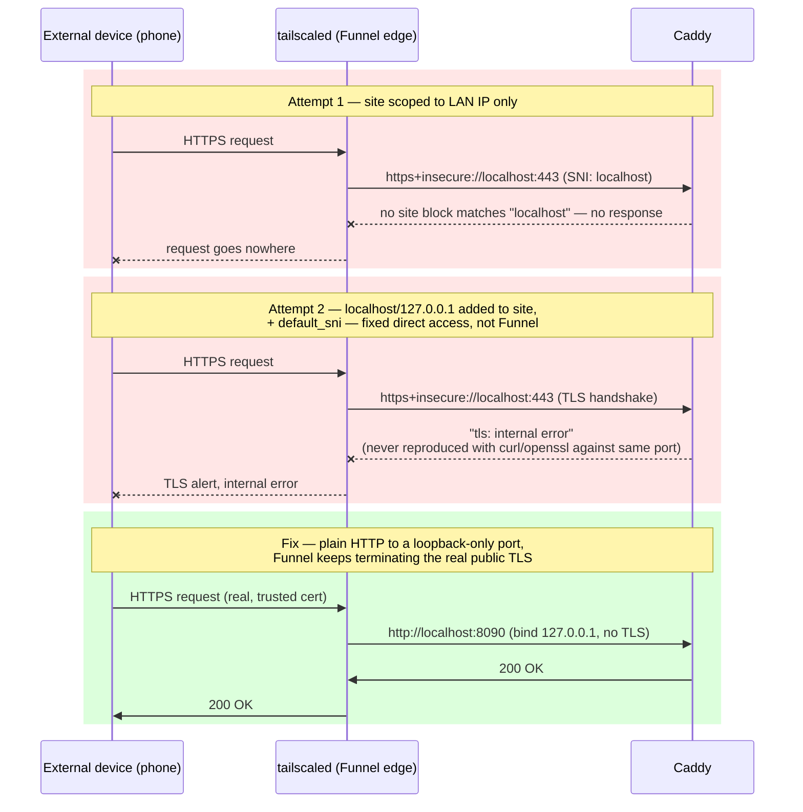

# deploy/

Deployment assets for running the Nutrition API on a plain Linux host
(bare metal, VM, or LXC container) with systemd.

For the container/PaaS path instead, see the `Dockerfile` and `.do/app.yaml`
in the repository root.

## systemd

`nutrition-api.service` runs uvicorn with two workers on port 8080, restarts on
failure, and logs to the journal.

It assumes the layout this repository is normally deployed with:

| Path | Purpose |
| :--- | :--- |
| `/opt/nutrition_api` | repository checkout |
| `/opt/nutrition_api/.venv` | virtualenv with `requirements.txt` installed |
| `/opt/nutrition_api/.env` | supplies `FDC_API_KEY` (gitignored — never commit it) |
| `/opt/nutrition_api/data` | GPC SQLite cache; the only writable path |
| `mcgarrah` | the user/group the service runs as |

If your checkout, user, or port differ, edit those fields before installing —
`WorkingDirectory`, `EnvironmentFile`, `ExecStart`, `ReadWritePaths`, `User`,
and `Group`.

### Install

```bash
sudo install -m 644 deploy/nutrition-api.service /etc/systemd/system/
sudo systemd-analyze verify /etc/systemd/system/nutrition-api.service
sudo systemctl daemon-reload
sudo systemctl enable --now nutrition-api.service
```

### Operate

```bash
sudo systemctl status nutrition-api      # current state
sudo journalctl -u nutrition-api -f      # follow logs
sudo systemctl restart nutrition-api     # pick up new code after a git pull
```

Once running: `http://<host>:8080/` is a landing page linking to the barcode
lookup tester (`/lookup`) and the name-search UI (`/search`), the OpenAPI docs
are at `/docs`, and `/api/v1/health` reports per-source status (it returns
`degraded`, not an error, when an upstream is unreachable).

### Hardening notes

The unit runs with `NoNewPrivileges`, `PrivateTmp`, `ProtectSystem=full`, and
`ProtectHome=read-only`. `data/` is granted back via `ReadWritePaths` because
the app self-updates the GS1 GPC taxonomy there on startup — dropping that line
makes the taxonomy update fail silently, so keep it if you move the data
directory.

`MemoryHigh`/`MemoryMax`/`CPUQuota` are sized for a 12 GB RAM / 4 vCPU host
that also runs Caddy and other services — adjust for your own box.

**uvicorn binds `0.0.0.0:8080`, not `127.0.0.1`,** so that other machines on
the LAN (and, once installed, the tailnet) can reach the backend directly for
debugging without going through Caddy. That only stays safe with a host
firewall restricting who can actually reach 8080 — Caddy's own protections
(rate limiting, TLS) don't help you if the backend is reachable by skipping
Caddy entirely. On this deployment that's enforced with `iptables`
(`iptables-persistent` keeps it across reboots):

```bash
sudo iptables -A INPUT -p tcp --dport 8080 -s 127.0.0.1 -j ACCEPT      # Caddy
sudo iptables -A INPUT -p tcp --dport 8080 -s <your-LAN-CIDR> -j ACCEPT
sudo iptables -A INPUT -p tcp --dport 8080 -s 100.64.0.0/10 -j ACCEPT  # tailnet
sudo iptables -A INPUT -p tcp --dport 8080 -j DROP
sudo apt-get install iptables-persistent && sudo netfilter-persistent save
```

If you don't need LAN/tailnet access to the raw backend, bind uvicorn to
`127.0.0.1` in `ExecStart` instead and skip the firewall rules — simpler, and
nothing but Caddy can ever reach port 8080 at all.

### Response store pruning (PLAN.md item 8)

`data/responses/` (the on-disk cache of upstream responses, see `app/core/
store.py`) has a serving TTL but nothing that ever deleted an aged-out file —
the directory could only grow. `nutrition-api-prune.timer` runs
`scripts/prune_response_store.py` weekly, removing anything past
`RESPONSE_STORE_PRUNE_AFTER_DAYS` (default: 3x the serving TTL, 90 days) or
with an unreadable/untrustworthy timestamp.

```bash
sudo install -m 644 deploy/nutrition-api-prune.service /etc/systemd/system/
sudo install -m 644 deploy/nutrition-api-prune.timer /etc/systemd/system/
sudo systemd-analyze verify /etc/systemd/system/nutrition-api-prune.service
sudo systemctl daemon-reload
sudo systemctl enable --now nutrition-api-prune.timer
```

```bash
sudo systemctl list-timers nutrition-api-prune.timer   # next scheduled run
sudo systemctl start nutrition-api-prune.service        # run it right now
sudo journalctl -u nutrition-api-prune -f                # follow its logs
```

Preview what a run would remove without deleting anything:

```bash
cd /opt/nutrition_api && .venv/bin/python3 scripts/prune_response_store.py --dry-run
```

### Scheduled mirror refresh (PLAN.md item 3)

Before this, refreshing `data/off.sqlite3`/`data/fdc.sqlite3` meant
remembering to run `build_off_db.py`/`build_fdc_db.py --auto-update`, then
`gh release create`/`upload` the new archive by hand, then restart the
service — nothing scheduled it, and the publish step was easy to forget
entirely (confirmed missing at least once: a same-day rebuild sat
unpublished until `nutrition-api-refresh.timer`'s own self-heal caught it).
`nutrition-api-refresh.timer` runs `scripts/refresh_mirrors.py` weekly: for
each mirror, it rebuilds via `--auto-update`, verifies the new row count
hasn't shrunk more than 10% (restoring the previous database if it has —
upstream export glitches happen), publishes the archive as a GitHub
release, and self-heals a currently-installed dataset that was never
published (a previous by-hand rebuild, or a run that crashed mid-way).
`nutrition-api.service` is restarted once at the end if anything actually
changed.

**One-time setup this needs beyond `install`/`enable`:**

- `gh` authenticated as the user the timer runs as (`gh auth status` to
  check) — needed to publish/check release assets.
- Passwordless sudo for exactly the one restart command, so the timer can
  pick up a rebuild without a human present:

  ```bash
  echo 'mcgarrah ALL=(root) NOPASSWD: /usr/bin/systemctl restart nutrition-api.service' \
    | sudo tee /etc/sudoers.d/nutrition-api-refresh
  sudo visudo -c   # verify the syntax before it's trusted
  ```

```bash
sudo install -m 644 deploy/nutrition-api-refresh.service /etc/systemd/system/
sudo install -m 644 deploy/nutrition-api-refresh.timer /etc/systemd/system/
sudo systemd-analyze verify /etc/systemd/system/nutrition-api-refresh.service
sudo systemctl daemon-reload
sudo systemctl enable --now nutrition-api-refresh.timer
```

```bash
sudo systemctl list-timers nutrition-api-refresh.timer   # next scheduled run
sudo systemctl start nutrition-api-refresh.service         # run it right now
sudo journalctl -u nutrition-api-refresh -f                 # follow its logs
```

Preview what a run would do — including whether either mirror's currently-
installed dataset is missing a published release — without publishing or
restarting anything:

```bash
cd /opt/nutrition_api && .venv/bin/python3 scripts/refresh_mirrors.py --dry-run
```

Refresh just one mirror, or rebuild/publish without ever restarting the
service:

```bash
.venv/bin/python3 scripts/refresh_mirrors.py --off-only
.venv/bin/python3 scripts/refresh_mirrors.py --fdc-only
.venv/bin/python3 scripts/refresh_mirrors.py --no-restart
```

## Caddy (public front — TLS + landing page)

`Caddyfile` puts a [Caddy](https://caddyserver.com/) reverse proxy in front of
the uvicorn service. Caddy terminates TLS with an automatically-provisioned
certificate, serves a static landing hub at the root (`site/index.html`), and
proxies the application and API paths to the backend on `127.0.0.1:8080`:

| Path | Served by |
| :--- | :--- |
| `/` | the static landing hub (Caddy, from `site/`) |
| `/status` | the status dashboard (Caddy, from `site/`) |
| `/caddy-health` | Caddy itself (proxy liveness) |
| `/lookup` | barcode (GTIN/UPC) lookup tester (backend) |
| `/search` | search by product name (backend) |
| `/data` | the data explorer (backend) — four tabs on one page: Data Browser, Data Quality, GPC Taxonomy, GPC Mappings (PLAN.md item 11) |
| `/gpc`, `/gpc/mappings`, `/data/analytics` | redirect into the right `/data` tab (backend) — kept working for old links, not separate pages any more |
| `/docs`, `/redoc`, `/openapi.json` | API docs (backend) |
| `/api/*` | JSON API (backend) |

The landing page and the status dashboard are served by Caddy itself, so they
stay up — and the dashboard reports the outage — even while the backend is
restarting. The routing lives in `caddy/site.caddy` and is imported by every
site block (the example `Caddyfile`, its `:8081` test block, and the installed
`/etc/caddy/Caddyfile`), so they cannot drift apart.

### Status dashboard

`/status` is a live health page grouping every moving part: the Caddy proxy
(checked directly via `/caddy-health`), the API backend, the on-disk cached
copies (USDA FDC, Open Food Facts, GPC, the response store) with their dataset
dates, and the external upstream APIs. It reads `/api/v1/health` through the
proxy and refreshes every 20 s. Because Caddy serves the page itself, a backend
outage shows as a red tile rather than an unreachable page.

### Tailscale Funnel

Publishing this site to the public internet with [Funnel](https://tailscale.com/kb/1223/funnel)
needs three changes beyond a normal Option A deployment (see the Caddyfile's
"Option A+" block for the exact config). The working setup, and the failure
modes it replaced along the way:



1. **Add `localhost`/`127.0.0.1` to the site address**, alongside the LAN IP.
   `tailscale funnel status` shows what its local proxy actually connects to —
   on this deployment it was `https+insecure://localhost:443` — and a site
   block scoped to `https://<LAN-IP>` only answers requests whose SNI/Host is
   that IP. A connection presenting `localhost` instead has no matching site
   and goes nowhere, which looks like Funnel silently not working. Caddy's
   internal CA issues certs for `localhost`/`127.0.0.1` the same way it does
   for the IP, so this is a one-line addition, not a new cert story. A
   `default_sni` global option is worth adding alongside it as a fallback for
   any connection that doesn't present a recognizable SNI at all.

2. **Give Funnel a plain-HTTP, loopback-only target instead of the HTTPS
   one**, if step 1 alone doesn't fix it. On this deployment, Funnel's local
   proxy client failed the TLS handshake against Caddy specifically —
   `tailscaled`'s own logs showed `http: proxy error: remote error: tls:
   internal error` — in a way that direct testing with `curl` or
   `openssl s_client` against the exact same port never reproduced, meaning
   it was specific to Funnel's own proxy client rather than a Caddy
   misconfiguration reachable by any other diagnostic. Rather than chasing
   that interop question further, the fix was to stop asking the loopback hop
   to speak TLS at all: Funnel already terminates real, publicly-trusted TLS
   on the actual internet-facing side, so the local hop from `tailscaled` to
   Caddy doesn't need its own TLS layer. A second Caddy site block on a bare
   port (`:8090`, `bind 127.0.0.1` so nothing but this host can ever reach it)
   serves the same `nutrition_api` snippet over plain HTTP, and Funnel is
   pointed at that instead:

   ```bash
   tailscale funnel reset
   tailscale funnel --bg http://localhost:8090
   ```

   **Testing note:** if the public Funnel URL fails when curled *from the
   same box that's running Funnel*, that is not conclusive — it may be a
   same-node routing quirk rather than a real problem (this happened during
   the original setup: identical, unexplained `TLS alert, internal error` on
   every self-test, zero corresponding log entries even immediately after a
   `tailscaled` restart, yet it worked immediately when tested from an actual
   external device). Test from a phone on cellular data or another network
   before concluding Funnel itself is broken.

3. **Bind the HTTPS site block to specific addresses instead of the `:443`
   wildcard.** `tailscaled` also listens on `:443`, but only on its own
   Tailscale-assigned addresses. A wildcard bind and a specific-address bind
   on the same port race at boot — whichever service starts first wins
   `:443` and the other fails with `listen tcp :443: bind: address already
   in use`. This surfaced on a reboot: `tailscaled` started first and Caddy
   crash-looped, silently taking the `:8090` Funnel target down with it (502
   from the outside, nothing obviously wrong from `tailscale funnel status`).
   Explicitly binding the HTTPS block to the addresses it actually serves —
   `bind 192.168.1.50 127.0.0.1 ::1` — removes the overlap entirely, so boot
   order no longer matters.

### Tailscale Services (multi-host readiness)

Separate from Funnel above, and set up 2026-07-19 as groundwork for future
HA / blue-green deployments, not because this deployment needs it today —
right now there is exactly one host (`nutrition-api-dev`), so this section
documents the mechanism, not a completed HA setup.

A [Tailscale Service](https://tailscale.com/kb/1553/tailscale-services) is a
named, tag-based identity (`svc:nutrition-api` here) that gets its own
tailnet DNS name and virtual IP, **decoupled from any one node**. One or
more nodes advertise themselves as backing it; Tailscale routes to whichever
advertising node is currently online. That is the actual value for this
project: bring up a second LXC, advertise it for the same service, and
requests get distributed/failed-over across both — the seed of HA and
blue-green rollouts, without standing up a separate load balancer. Node-
based Funnel (above) can't do this — it is inherently tied to one node's own
hostname.

**Two steps are required, and doing only the first one is the mistake to
avoid** — it's what produced "Advertising the service, but configuration is
missing" the first time through this:

1. `tailscale serve advertise svc:nutrition-api` — registers this node as
   *willing* to host the service. On its own this does nothing else; it
   creates no routing rule, which is exactly why the service showed as
   configured-but-empty.
2. `tailscale serve --service=svc:nutrition-api --bg http://localhost:8090`
   — the step that was actually missing. Defines *what* the service
   proxies to. Points at the same loopback-only Caddy block (`:8090`) that
   Funnel already targets above, for the same reason: it's already a
   working plain-HTTP target, so nothing new needs configuring on the Caddy
   side.

Verify with `tailscale serve status --json` — a correctly configured
service shows up under its own top-level `"Services"` key, e.g.:

```json
"Services": {
  "svc:nutrition-api": {
    "TCP": { "443": { "HTTPS": true } },
    "Web": {
      "nutrition-api.squeaker-interval.ts.net:443": {
        "Handlers": { "/": { "Proxy": "http://localhost:8090" } }
      }
    }
  }
}
```

That `"Services"` key is confirmed **separate from** the node's own `"Web"`/
`"AllowFunnel"` entries in the same JSON output — setting up the service does
not touch or replace the existing node-based Funnel config; both are live
at once, independently. `nutrition-api.squeaker-interval.ts.net` resolves
to its own synthetic virtual IP (a distinct address from the node's own
tailnet IP), not to `nutrition-api-dev`'s address.

**A second host, later, only needs step 2 run locally on it** (same
`--service=svc:nutrition-api --bg http://localhost:8090`, assuming it also
runs its own Caddy on `:8090` the same way) — no change needed here. The
admin console's Services view reports how many hosts are currently
online for a service; today that reads "1 online."

The service is tailnet-internal only right now — nothing has run
`tailscale funnel --service=svc:nutrition-api ...` to expose it to the
public internet the way the node's own hostname already is. The node-based
Funnel URL remains the public entry point; extending Funnel to the service
itself is a separate decision for whenever a second host actually exists.

### Install (Debian/Ubuntu, via apt)

```bash
sudo apt install -y debian-keyring debian-archive-keyring apt-transport-https curl
curl -1sLf 'https://dl.cloudsmith.io/public/caddy/stable/gpg.key' \
  | sudo gpg --dearmor -o /usr/share/keyrings/caddy-stable-archive-keyring.gpg
curl -1sLf 'https://dl.cloudsmith.io/public/caddy/stable/debian.deb.txt' \
  | sudo tee /etc/apt/sources.list.d/caddy-stable.list
sudo apt update && sudo apt install -y caddy
```

The package installs `caddy.service`, which reads `/etc/caddy/Caddyfile`.

### Configure

Point `/etc/caddy/Caddyfile` at the shared snippet and pick how it listens.
Every variant `import`s the same `caddy/site.caddy`, so only the site line
changes.

**HTTPS by IP with Caddy's internal CA** (a LAN box, no domain) — what this
deployment uses:

```
import /opt/nutrition_api/deploy/caddy/site.caddy
https://192.168.1.50 {
	import nutrition_api
}
```

Naming the site `https://<IP>` makes Caddy issue a certificate for that address
from its own internal CA — it cannot get a *publicly*-trusted cert for a bare IP
— and redirect `http://` to `https://` automatically. Browsers warn until that
CA is trusted (next section).

**By domain with automatic, publicly-trusted HTTPS** (public host that resolves
to this machine, ports 80/443 reachable): use your hostname as the site name —
Caddy provisions and renews the cert via ACME, and there is no CA to trust.

```
import /opt/nutrition_api/deploy/caddy/site.caddy
nutrition.example.org {
	import nutrition_api
}
```

**Plain HTTP, no TLS** (throwaway/local): add a `{ auto_https off }` global
block and use `:80` as the site name.

If the checkout is not at `/opt/nutrition_api`, set `NUTRITION_SITE_ROOT` (or
edit the `root` in `caddy/site.caddy`) and fix the `import` path.

### Trusting the internal CA (self-signed by IP)

With the internal-CA variant, Caddy generates a long-lived root once per host.
Installing that root on your client machines turns the browser warning into a
green lock. The root is downloadable from the proxy itself:

```bash
# Fetch it (‑k because the connection isn't trusted yet)
curl -k https://<IP>/caddy-local-ca.crt -o caddy-local-ca.crt
# …or straight from the host
sudo cat /var/lib/caddy/.local/share/caddy/pki/authorities/local/root.crt
```

Then trust it:

- **Linux:** `sudo cp caddy-local-ca.crt /usr/local/share/ca-certificates/ && sudo update-ca-certificates`
- **macOS:** double-click → Keychain Access → set to *Always Trust*
- **Windows:** import into *Trusted Root Certification Authorities*
- **Chrome/Firefox** (if they use their own store): import under Settings →
  Security → Manage certificates → Authorities.

The CA root is generated per host, so it is **not** committed to the repo
(`deploy/site/caddy-local-ca.crt` is git-ignored). Publishing your own root to
your own machines is fine; it authorises certs only for what this Caddy issues.

### Reusing a multi-backend Caddy config

If you already run a Caddy LXC in front of other resources, the only piece that
transfers here is the `https://<IP>` site name for the internal-CA cert. The
rest of a Proxmox/Ceph-style config does **not** apply: this backend is a single
plain-HTTP uvicorn on `127.0.0.1:8080`, so there is no load balancing
(`lb_policy`, multiple `to` upstreams), no `tls_insecure_skip_verify` (that is
for HTTPS upstreams with self-signed certs), and no WebSocket or `Location`
header rewriting. If you *do* put several backends behind it later,
`reverse_proxy`'s active health checks (`health_uri /api/v1/health`,
`health_interval`, `health_status 200`) are the pattern to copy.

### Verify, then run

```bash
sudo caddy validate --config /etc/caddy/Caddyfile
sudo systemctl reload caddy          # or restart

# Local smoke test straight from the repo — serves on http://localhost:8081/
caddy run --config deploy/Caddyfile
```

The `:8081` block in the repo `Caddyfile` shares the same snippet as the
installed config, so what you smoke-test is what you deploy.

Caddy and the `nutrition-api` service are independent — restart or update the
backend without touching Caddy, and the landing page and status dashboard never
go down with it.
